# The Complete Angular Guide to DeutschLingoDeck

### A Technical Handbook for Java / Spring Boot Developers

---

## How to read this document

This handbook teaches the DeutschLingoDeck Angular frontend by explaining the actual code that lives in `frontend/src/app`. It does not teach generic Angular — every concept is anchored to a real file, a real component, or a real service in this repository. Where the project deviates from best practice, or leaves something unfinished, this document says so explicitly rather than inventing a cleaner story.

The intended reader is a backend engineer who is comfortable with Spring Boot, dependency injection, REST controllers, and layered architecture, but who has little or no Angular experience. Every chapter therefore closes the loop back to a Spring Boot equivalent wherever one exists.

Two companion documents already exist in this repository and are referenced throughout:

- `docs/DeutschLingoDeck - Frontend Architecture - v1.md` — the architectural *intent* the team agreed on before writing code.
- `docs/DeutschLingoDeck - OpenApi Specification - v1.yaml` — the contract the Angular services in this guide talk to.

This guide is the third leg: it explains what was actually *built*, and how it maps onto that intent.

---

# 1. Introduction

## 1.1 What Angular is

Angular is an opinionated, batteries-included application framework maintained by Google. "Framework" is the operative word — where React is a rendering library that you assemble a stack around (router, HTTP client, forms, DI, all third-party choices), Angular ships all of those pieces itself, versioned and released together. DeutschLingoDeck's `frontend/package.json` shows this clearly: `@angular/core`, `@angular/router`, `@angular/forms`, `@angular/common` (which includes `HttpClient`), and `@angular/material` are all first-party, all on the same `^22.0.0` version line.

For a Spring Boot developer, this is a familiar shape: Spring Boot also bundles a curated, versioned set of libraries (Spring MVC, Spring Data, Spring Security) behind a single "starter" story rather than making you assemble Jakarta EE pieces by hand. Angular is to frontend frameworks roughly what Spring Boot is to Java web frameworks: it optimizes for a consistent, well-trodden path over maximum flexibility.

## 1.2 SPA architecture

DeutschLingoDeck is a **Single Page Application** (SPA). The browser loads one HTML document (`frontend/src/index.html`), and Angular's `Router` then rewrites the visible content in place as the user navigates between `/dashboard`, `/dictionaries`, `/games/42`, and so on — no full page reload, no new document fetched from the server for each URL. The Spring Boot backend (`backend/`) becomes a pure JSON API; it no longer renders HTML views (there is no Thymeleaf, no JSP, no server-side templating in this backend at all — see `backend/src/main/java/com/deutschlingodeck/*/controller`, every controller method returns a `ResponseEntity<SomeDto>`).

This has a direct architectural consequence explored throughout this guide: **all UI state, routing state, and rendering now lives in the browser**, and the backend's job shrinks to authentication, validation, persistence, and business rules — exactly what a Spring `@RestController` layer is good at.

## 1.3 Angular application lifecycle (bird's-eye view)

At a high level, every request to the Angular app goes through these phases:

1. **Bootstrap** — the JS bundle loads, `bootstrapApplication()` runs, the root `App` component is created and inserted into `<body>`.
2. **Dependency injection setup** — all `providers` registered in `app.config.ts` (HTTP client, router, interceptors, the auth session restore hook) become available for injection.
3. **Routing** — the `Router` matches the current URL against `app.routes.ts` and lazy-loads + renders the corresponding feature.
4. **Component tree rendering** — each component's template is compiled and rendered, with Angular's change detection keeping the DOM in sync with component state (increasingly via Signals — see chapter 8).
5. **User interaction** — event bindings call component methods, which call services, which call `HttpClient`, which goes through the interceptor chain to the Spring Boot API.
6. **Reactive update** — the response updates a signal or observable, change detection re-renders only the affected DOM.

Chapter 3 walks through phases 1–2 in detail with a sequence diagram; chapter 26 walks through the *entire* lifecycle end-to-end, including the backend and database.

## 1.4 How Angular differs from React and Vue

This isn't a general education section — it matters because it explains *why* the code in this repository looks the way it does.

| Aspect | Angular (this project) | React | Vue |
|---|---|---|---|
| Language | TypeScript is mandatory, deeply integrated (decorators, strict templates) | JavaScript/TypeScript optional | JavaScript/TypeScript optional |
| Component definition | Class + decorator metadata (`@Component`), e.g. `frontend/src/app/app.ts` | Function returning JSX | `<script setup>` + template SFC |
| Templates | Separate HTML-like syntax with its own control flow (`@if`, `@for`, see chapter 9), compiled ahead-of-time | JSX, real JavaScript | Vue template syntax |
| Dependency Injection | Built-in, hierarchical, framework-level (chapter 7) | Not built-in — Context API is a weaker substitute | `provide`/`inject`, weaker than Angular's |
| HTTP client | Built-in `HttpClient` with interceptors (chapter 11, 13) | None — you pick `fetch`/`axios` | None |
| Routing | Built-in `@angular/router` (chapter 6) | None — you pick `react-router` | Built-in `vue-router` |
| Forms | Built-in Reactive Forms module (chapter 10) | None — you pick Formik/RHF | Built-in but less structured |
| Change detection | Historically zone.js + dirty checking; this project instead leans on **Signals** (chapter 8) | Virtual DOM diffing | Reactivity via Proxies |

The practical upshot for this codebase: almost nothing in `frontend/package.json`'s `dependencies` block is a third-party choice. `express`, `rxjs`, and `tslib` are the only non-`@angular/*` runtime dependencies. Everything else — routing, HTTP, forms, DI — is Angular itself. This is the same "convention over configuration, batteries included" philosophy Spring Boot brings to the JVM.

## 1.5 Why Angular was selected for this project

`docs/DeutschLingoDeck - Frontend Architecture - v1.md` states the technology stack directly (§2): Angular 22, TypeScript, Standalone Components, Signals, RxJS, Router, HttpClient, Reactive Forms, Angular Material — "NgModules should not be introduced unless absolutely necessary." Reading between the lines of that document and the resulting code, the rationale is:

- **Strong typing end-to-end.** The backend is Java/Spring; a strongly-typed frontend (TypeScript interfaces mirroring backend DTOs, see chapter 16) keeps the same rigor across the stack instead of dropping into loosely-typed JavaScript.
- **A single, coherent framework for a solo/small team.** Rather than assembling routing + forms + HTTP + DI from separate ecosystems (as a React app would), Angular gives one blessed way to do each, which reduces decisions for a project built rapidly with heavy AI-assisted code generation (see `docs/DeutschLingoDeck - Development Guidelines - v1.md` §25 "Development Rules for Claude Code" — the project was explicitly built with an LLM-following, rule-based workflow, which benefits enormously from Angular's opinionated structure).
- **Angular Material** provides a production-looking UI (tables, dialogs, forms, navigation) without needing a design system built from scratch — see chapter 20.

---

# 2. Project Architecture

## 2.1 The real folder structure

This is the actual layout under `frontend/src/app`, gathered by inspecting the repository (not copied from a spec — it matches the spec in `docs/DeutschLingoDeck - Frontend Architecture - v1.md` almost exactly, which tells you the team followed the architecture document faithfully):

```text
src/app
├── app.config.ts              # bootstrap providers (browser)
├── app.config.server.ts       # bootstrap providers (server/SSR)
├── app.routes.ts              # root route table
├── app.routes.server.ts       # per-route SSR render mode
├── app.ts / app.html / app.css
│
├── core/
│   ├── auth/                  # AuthService, AuthApiService, TokenStorageService
│   ├── config/                # API_BASE_URL injection token
│   ├── guards/                # authGuard, guestGuard
│   ├── interceptors/          # auth / error / refresh-token interceptors
│   ├── models/                # User, AuthResponse
│   └── services/              # GlobalErrorHandler
│
├── layout/
│   ├── app-shell/              # authenticated shell (sidenav + header + footer)
│   ├── header/
│   ├── sidebar/
│   ├── navigation/              # NAVIGATION_ITEMS data
│   └── footer/
│
├── shared/
│   ├── components/             # avatar, badge, breadcrumbs, charts, empty-state,
│   │                           # error-state, inline-alert, loading-spinner,
│   │                           # page-header, stat-card
│   ├── dialogs/                # confirm-dialog component + service
│   ├── models/                 # ApiError, FieldError, PageResponse<T>
│   └── utils/                  # passwordsMatchValidator
│
└── features/
    ├── authentication/         # login, register pages + routes
    ├── dashboard/               # dashboard page + routes
    ├── dictionaries/            # list/details/import/card-details pages, services, state
    ├── games/                   # start/active/summary/history pages, services, state
    ├── gamification/            # XP, achievements, daily goal (models + service, no pages)
    ├── statistics/               # statistics dashboard page + service
    ├── profile/                  # profile page + service
    ├── ai-assistant/             # AI vocabulary generation (models + stub service, no pages)
    └── errors/                   # access-denied, not-found pages
```

Two small honest notes for accuracy: the architecture spec (§9) lists `directives` and `pipes` folders under `shared/` — neither exists in the actual code yet; nothing in this project currently needs a custom structural directive or a custom pipe (only Angular's built-in `DatePipe` is used, e.g. `frontend/src/app/features/dictionaries/pages/dictionary-list-page/dictionary-list-page.component.ts`). This is a case of the architecture document describing capacity for future growth rather than current reality — worth remembering when reading any "should" in that document as aspirational, not necessarily implemented.

## 2.2 Package diagram

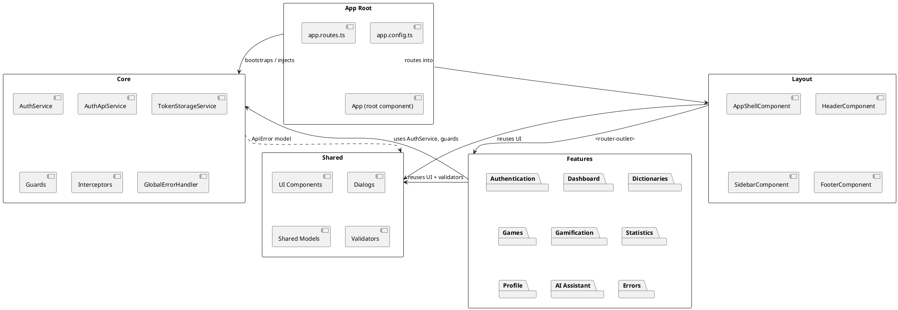

## 2.3 Responsibilities of every package

**`core/`** — singleton, application-wide concerns that exist exactly once for the life of the app: who is logged in, how HTTP requests get authenticated, what happens on error. This package must never import from `features/` — dependencies only flow *outward* from core. It is the closest analogue to a Spring Boot project's `security` + `config` packages combined.

**`layout/`** — the authenticated application shell: header, sidebar, footer, and the responsive shell component that arranges them. Nothing here contains business logic; `AppShellComponent` only decides *whether the sidebar is a permanent panel or an overlay drawer* (see chapter 4). Public pages (login, register) deliberately bypass this package entirely — see the routing table in chapter 6.

**`shared/`** — dumb, reusable, presentation-only building blocks (badges, empty states, a confirm dialog) plus shared TypeScript models and one cross-cutting validator. Nothing in `shared/` is allowed to know about a specific feature; `EmptyStateComponent` doesn't know it's used on the dictionaries page. This is comparable to a Spring Boot `common`/`shared` package holding generic `ErrorResponse` DTOs and utility beans used by every module — and indeed, `backend/src/main/java/com/deutschlingodeck/common` plays exactly that role on the backend.

**`features/`** — one folder per business capability, each independently lazy-loadable (chapter 6) and each owning its own `pages/`, `services/`, `models/`, and sometimes `state/` subfolders. This directly mirrors the backend's package-by-feature layout (`authentication/`, `dictionary/`, `game/`, `gamification/`, `profile/`, `statistics/` under `backend/src/main/java/com/deutschlingodeck/`) — the frontend and backend are sliced along the *same seams*, which is why a request to `/dictionaries` on the frontend talks to a `DictionaryController` in a package literally named `dictionary` on the backend.

---

# 3. Bootstrapping

## 3.1 `main.ts` — the real entry point

```typescript
// frontend/src/main.ts
import { bootstrapApplication } from '@angular/platform-browser';
import { appConfig } from './app/app.config';
import { App } from './app/app';

bootstrapApplication(App, appConfig)
  .catch((err) => console.error(err));
```

This is the entire client entry point. `bootstrapApplication()` is the modern, standalone-components replacement for the old `platformBrowserDynamic().bootstrapModule(AppModule)` call you'll see in older Angular tutorials — there is no `AppModule` anywhere in this codebase, by design (see the architecture doc, §2: "NgModules should not be introduced unless absolutely necessary").

Compare this to a Spring Boot entry point:

```java
@SpringBootApplication
public class DeutschLingoDeckApplication {
    public static void main(String[] args) {
        SpringApplication.run(DeutschLingoDeckApplication.class, args);
    }
}
```

Both are minimal by design: one call, one config object (`appConfig` ↔ Spring's auto-configuration + `application.yml`), one root object to construct (`App` ↔ the Spring `ApplicationContext`).

## 3.2 `app.config.ts` — the provider graph

```typescript
// frontend/src/app/app.config.ts
export const appConfig: ApplicationConfig = {
  providers: [
    provideBrowserGlobalErrorListeners(),
    provideRouter(routes, withComponentInputBinding()),
    provideClientHydration(),
    provideHttpClient(
      withFetch(),
      withInterceptors([authInterceptor, errorInterceptor, refreshTokenInterceptor])
    ),
    { provide: API_BASE_URL, useValue: environment.apiBaseUrl },
    { provide: ErrorHandler, useClass: GlobalErrorHandler },
    {
      provide: APP_INITIALIZER,
      useFactory: restoreSessionOnBootstrap,
      multi: true,
    },
  ],
};
```

Each entry is a provider — the Angular DI equivalent of a Spring `@Bean` definition. Reading top to bottom:

1. `provideBrowserGlobalErrorListeners()` — hooks `window.onerror`/`unhandledrejection` so uncaught errors reach Angular's error handling instead of silently vanishing in the console.
2. `provideRouter(routes, withComponentInputBinding())` — installs the router with the root route table (chapter 6) and turns on automatic route-parameter-to-`@Input()`/`input()` binding (used by `ActiveGamePageComponent.gameId`, see chapter 6.6).
3. `provideClientHydration()` — enables SSR hydration: the client reuses the server-rendered DOM instead of tearing it down and re-rendering from scratch (chapter 23).
4. `provideHttpClient(withFetch(), withInterceptors([...]))` — configures `HttpClient` to use the browser `fetch` API under the hood (rather than `XMLHttpRequest`) and installs the three functional interceptors, **in this exact order**, which chapter 13 explains is load-bearing.
5. `{ provide: API_BASE_URL, useValue: environment.apiBaseUrl }` — a plain value provider binding an `InjectionToken` to a string (`http://localhost:8080/api/v1` in `frontend/src/environments/environment.ts`). This is the DI equivalent of `@Value("${api.base-url}")` in Spring.
6. `{ provide: ErrorHandler, useClass: GlobalErrorHandler }` — overrides Angular's built-in `ErrorHandler` with the project's own (chapter 14). This is a **class provider**: Angular constructs `GlobalErrorHandler` via DI whenever something asks for `ErrorHandler`.
7. The `APP_INITIALIZER` entry is the most interesting one and deserves its own subsection.

## 3.3 Session restoration via `APP_INITIALIZER`

```typescript
function restoreSessionOnBootstrap(): () => Promise<boolean> {
  const authService = inject(AuthService);
  return () => firstValueFrom(authService.restoreSession());
}
```

`APP_INITIALIZER` is a **multi-provider** (`multi: true`) — Angular collects every provider registered against this token into an array and runs all of their factory functions before the application is considered "ready" to render routes. Here there is exactly one: it asks `AuthService` to check for a stored JWT and, if one exists, fetch the current user (`GET /auth/me`) *before* the router activates the first route. This is why a logged-in user who refreshes the page on `/dashboard` doesn't get bounced to `/login` for a flash of a frame — the router's `authGuard` (chapter 6.4) only ever evaluates after this initializer resolves.

Worth flagging directly, since precision matters more than tidiness here: `APP_INITIALIZER` is the *older* Angular API for this pattern. Angular now recommends `provideAppInitializer(fn)`, a simpler, non-multi, non-factory-returning-a-factory API introduced specifically to replace this exact boilerplate (the double-function shape — a factory that returns another function — exists only because `APP_INITIALIZER` predates dependency injection inside initializers). This project still uses the legacy form; it works correctly on Angular 22 (the token isn't deprecated, just superseded), but if you're extending this pattern, `provideAppInitializer(() => inject(AuthService).restoreSession())`-style code is the more idiomatic Angular 22 way to write a new one.

The Spring Boot analogue is a `CommandLineRunner` or `ApplicationRunner` bean — code that runs once at startup, after the context is built, before the app is "live." The difference is scope: Spring's runner executes once for the whole server process; Angular's `APP_INITIALIZER` executes once *per browser tab*, every time the SPA boots.

## 3.4 `bootstrapApplication()` — what happens internally

`bootstrapApplication(App, appConfig)` does, in order:

1. Creates a fresh Angular **environment injector** and registers every provider from `appConfig.providers`.
2. Runs all `APP_INITIALIZER` factories and waits for their promises to resolve (this is where session restoration happens).
3. Instantiates the root component (`App`) through that injector, resolving its constructor/`inject()` dependencies.
4. Renders `App`'s template (`app.html`, just `<router-outlet></router-outlet>`) into the `<app-root>` element that `index.html` contains.
5. Hands control to the `Router`, which reads the current URL and activates the matching route.

## 3.5 Server bootstrap — `main.server.ts` and `app.config.server.ts`

```typescript
// frontend/src/main.server.ts
const bootstrap = (context: BootstrapContext) =>
  bootstrapApplication(App, config, context);
export default bootstrap;
```

```typescript
// frontend/src/app/app.config.server.ts
const serverConfig: ApplicationConfig = {
  providers: [provideServerRendering(withRoutes(serverRoutes))],
};
export const config = mergeApplicationConfig(appConfig, serverConfig);
```

The server entry point reuses **the same `appConfig`** and layers server-only providers on top via `mergeApplicationConfig` — the same DI container, the same interceptors, the same routes, just with an additional `provideServerRendering(withRoutes(serverRoutes))` that tells Angular's SSR engine which route gets which rendering strategy (chapter 23 covers `serverRoutes` in full). This "one config, two entry points" pattern avoids the classic SSR bug of client and server disagreeing about what providers exist.

## 3.6 Sequence diagram: browser open → first component

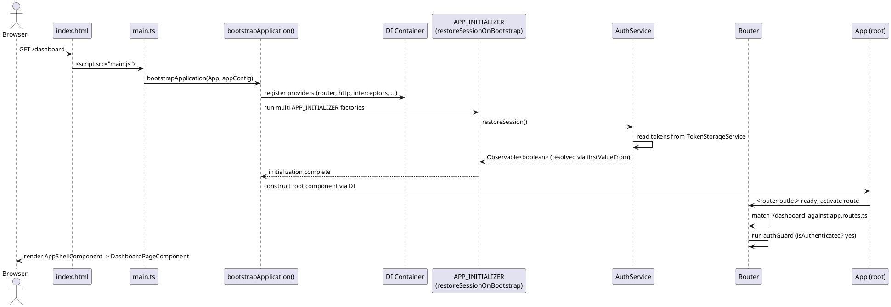

---

# 4. Standalone Components

## 4.1 Why standalone components exist

Classic Angular (pre-v14) required every component to be declared in exactly one `NgModule`, and every `NgModule` had to import the modules that exported the directives/pipes/components it used. This produced a second, parallel bookkeeping structure on top of the component tree itself — the `AppModule`, `FeatureModule`, `SharedModule` pyramid — whose sole purpose was wiring, not behavior. Standalone components (stabilized in Angular 15, now the default and *only* option used in this project) collapse that bookkeeping: each component declares its own dependencies directly.

Look at `FooterComponent`, the simplest component in the codebase:

```typescript
// frontend/src/app/layout/footer/footer.component.ts
@Component({
  selector: 'app-footer',
  changeDetection: ChangeDetectionStrategy.OnPush,
  template: `
    <footer class="footer">
      <p>DeutschLingoDeck &copy; {{ year }}</p>
    </footer>
  `,
  styles: `...`,
})
export class FooterComponent {
  protected readonly year = new Date().getFullYear();
}
```

There is no `imports: []` here because `FooterComponent` uses no other Angular building blocks — it's pure interpolation. Compare `HeaderComponent`, which does need other pieces:

```typescript
// frontend/src/app/layout/header/header.component.ts
@Component({
  selector: 'app-header',
  imports: [MatToolbarModule, MatButtonModule, MatIconModule, MatMenuModule, RouterLink, AvatarComponent],
  changeDetection: ChangeDetectionStrategy.OnPush,
  templateUrl: ...,
})
export class HeaderComponent { ... }
```

`imports` here is not a legacy `NgModule` list — it is metadata *on the component itself*, saying "when compiling my template, these are the only extra selectors you're allowed to use." There is no `AppModule` anywhere that also has to know about `HeaderComponent`; nothing outside `HeaderComponent`'s own file declares this relationship.

## 4.2 Component metadata, piece by piece

Take `StatCardComponent` as a complete, small example (`frontend/src/app/shared/components/stat-card/stat-card.component.ts`):

```typescript
@Component({
  selector: 'app-stat-card',
  imports: [MatCardModule, MatIconModule],
  changeDetection: ChangeDetectionStrategy.OnPush,
  template: `...`,
  styles: `...`,
})
export class StatCardComponent {
  readonly label = input.required<string>();
  readonly value = input.required<string | number>();
  readonly icon = input<string | undefined>(undefined);
}
```

- **`selector`** — the custom HTML tag other templates use to place this component (`<app-stat-card>`), analogous to registering a custom JSP/Thymeleaf tag, except type-checked at compile time.
- **`imports`** — the dependency list for the template compiler, described above.
- **`changeDetection: ChangeDetectionStrategy.OnPush`** — used on almost every component in this codebase. It tells Angular's change detector to skip re-checking this component's view unless one of its `@Input()`/`input()` references changes identity, an event originates from inside it, or an `async`/signal it reads changes. This is a deliberate, consistent choice across the whole app (grep the codebase — every component in `shared/`, `layout/`, and every page under `features/` sets this explicitly) and is the single biggest lever for rendering performance (chapter 22).
- **`template`/`templateUrl` + `styles`/`styleUrl`** — inline vs. file-based template and styles. Both styles exist side-by-side in this codebase: small, presentation-only components (like `StatCardComponent`, `HeaderComponent`, `AppShellComponent`) use inline `template`/`styles` strings; larger page components (like `LoginPageComponent`, `DictionaryListPageComponent`) use separate `.html`/`.css` files via `templateUrl`/`styleUrl`. The convention actually applied in this repo: **inline for small, single-purpose shared/layout components; separate files once a template exceeds roughly a screenful**.
- **The class body** — plain TypeScript. No inheritance from a framework base class is required; a component is a component purely because of the decorator.

## 4.3 Style encapsulation

Angular defaults every component to `ViewEncapsulation.Emulated`: styles written in a component's `styles`/`styleUrl` are scoped to that component's template only, by rewriting selectors with hidden attribute markers at compile time (e.g. `.badge[_ngcontent-xyz]`). This is why `BadgeComponent`'s `.badge--danger` class (`frontend/src/app/shared/components/badge/badge.component.ts`) never leaks out to style some unrelated `.badge--danger` element on another page, and vice versa — no naming convention or CSS Modules tooling is needed to get this guarantee; it's structural. No component in this codebase overrides this default (no `ViewEncapsulation.None` anywhere), which is the right default for a project with many independently-authored feature pages.

`frontend/src/styles.css` and `frontend/src/material-theme.scss` are the two genuinely *global*, unencapsulated style sources — loaded once via `angular.json`'s `styles` array (chapter 19) — everything else stays local to its component.

## 4.4 Change detection, briefly (full treatment in chapter 8 and 22)

With `OnPush`, a component only re-renders when Angular has a *reason* to believe something changed — new signal value read in its template, new `@Input()`/`input()` reference, an internal event handler ran, or an async pipe emitted. This project doesn't fight this default anywhere (no `ChangeDetectorRef.detectChanges()` manual calls exist in the codebase) — it consistently pairs `OnPush` with signals for local state, which is exactly the combination Angular's own docs recommend, and the combination that makes `OnPush` painless rather than a source of stale-UI bugs.

## 4.5 Best practice / common mistake in this exact codebase

A common Angular mistake with `OnPush` is mutating an array or object input in place (`this.items.push(x)`) instead of replacing the reference (`this.items = [...this.items, x]`), because `OnPush` compares by reference and a mutated-in-place array looks unchanged to the change detector. This project avoids that trap structurally: state services expose signals and always call `.set()`/`.update()` with new arrays/objects (see `DictionaryListStateService.removeLocally()` in chapter 15, which does `dictionaries.filter(...)` — a new array — never `.splice()`).

---

# 5. Component Tree

## 5.1 The full authenticated-shell hierarchy

Below is the actual component tree DeutschLingoDeck renders once a user is logged in and sitting on the dashboard. Route-activated components are marked; everything else is a directly-nested child component.

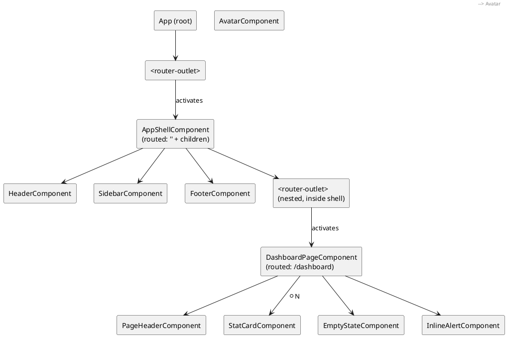

## 5.2 Public (unauthenticated) tree

Login and Register never mount `AppShellComponent` at all — they are top-level routes, siblings of the guarded `''` route (chapter 6):

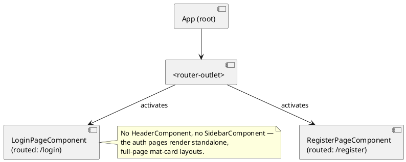

## 5.3 Dictionaries feature subtree (representative of every feature)

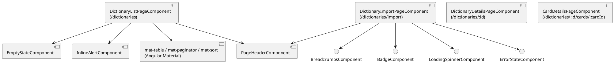

Every feature page follows this same shape: a thin page component composing `shared/components/*` building blocks and Angular Material modules, with all data access delegated to a feature service (chapter 15) — never `HttpClient` directly in the component (chapter 11).

---

# 6. Routing

## 6.1 `provideRouter()` and the root configuration

Recall from `app.config.ts`:

```typescript
provideRouter(routes, withComponentInputBinding())
```

`provideRouter` is the standalone replacement for `RouterModule.forRoot(routes)`. The `withComponentInputBinding()` feature is what allows `ActiveGamePageComponent` to declare `readonly gameId = input.required<string>();` and have the router populate it automatically from the `:gameId` path parameter — no `ActivatedRoute.snapshot.paramMap.get('gameId')` boilerplate required (chapter 6.6 shows this in full).

## 6.2 The actual route table

```typescript
// frontend/src/app/app.routes.ts
export const routes: Routes = [
  ...AUTHENTICATION_ROUTES,               // /login, /register (public, guestGuard)

  {
    path: '',
    canActivate: [authGuard],              // <-- protects everything nested below
    loadComponent: () => import('./layout/app-shell/app-shell.component')
                            .then((m) => m.AppShellComponent),
    children: [
      { path: '', pathMatch: 'full', redirectTo: 'dashboard' },
      { path: 'dashboard',    loadChildren: () => import('./features/dashboard/dashboard.routes').then(m => m.DASHBOARD_ROUTES) },
      { path: 'dictionaries', loadChildren: () => import('./features/dictionaries/dictionaries.routes').then(m => m.DICTIONARIES_ROUTES) },
      { path: 'game',         loadChildren: () => import('./features/games/games.routes').then(m => m.GAME_ROUTES) },
      { path: 'games',        loadChildren: () => import('./features/games/games.routes').then(m => m.GAME_HISTORY_ROUTES) },
      { path: 'statistics',   loadChildren: () => import('./features/statistics/statistics.routes').then(m => m.STATISTICS_ROUTES) },
      { path: 'profile',      loadChildren: () => import('./features/profile/profile.routes').then(m => m.PROFILE_ROUTES) },
    ],
  },

  { path: 'access-denied', loadComponent: () => import('.../access-denied-page.component').then(m => m.AccessDeniedPageComponent) },
  { path: 'not-found',     loadComponent: () => import('.../not-found-page.component').then(m => m.NotFoundPageComponent) },
  { path: '**', redirectTo: 'not-found' },
];
```

Two details worth calling out precisely because they're easy to misread:

- `game` and `games` are **two different top-level segments** loading from the **same routes file** (`games.routes.ts`), which exports two separate `Routes` arrays (`GAME_ROUTES` for the live gameplay flow, `GAME_HISTORY_ROUTES` for the read-only history list). This isn't a typo — it's a deliberate URL design: `/game/:id` is a session in progress, `/games` is the historical index, and they happen to be implemented in one file for cohesion.
- The guarded `''` route wraps **all** feature children in a single `canActivate: [authGuard]`. Angular evaluates a parent route's guards once, before any of its children activate — so `authGuard` runs exactly once per navigation into the authenticated area, not once per feature.

## 6.3 Lazy loading

Every single feature route above uses `loadComponent` or `loadChildren` with a dynamic `import()` — there is **no eagerly-loaded feature** in this application except the always-needed `AppShellComponent` and the two auth pages (which are small enough that eager-loading them barely matters, and eager-loading `login` specifically avoids an extra round trip for the very first thing an unauthenticated visitor sees). This means the initial JS bundle a browser downloads for `/login` is small; the ~10 feature bundles (dashboard, dictionaries, games, statistics, profile, and their nested pages) are only fetched the first time a user actually navigates to each one. Chapter 22 quantifies why this matters for bundle size.

The Spring Boot mental model closest to this is deferred/lazy bean initialization — except here it is literal network-level code splitting: the browser genuinely does not download `dictionary-import-page.component.js` until the user clicks "Dictionaries."

## 6.4 Route guards in this routing table

```typescript
// frontend/src/app/core/guards/auth.guard.ts
export const authGuard: CanActivateFn = () => {
  const authService = inject(AuthService);
  const router = inject(Router);
  if (authService.isAuthenticated()) return true;
  return router.createUrlTree(['/login']);
};
```

```typescript
// frontend/src/app/core/guards/guest.guard.ts
export const guestGuard: CanActivateFn = () => {
  const authService = inject(AuthService);
  const router = inject(Router);
  if (!authService.isAuthenticated()) return true;
  return router.createUrlTree(['/dashboard']);
};
```

Both are **functional guards** (`CanActivateFn`, a plain arrow function using `inject()`), the modern replacement for class-based guards implementing `CanActivate`. Returning `true` allows navigation; returning a `UrlTree` (via `router.createUrlTree`) tells the router to redirect there *instead* — this is preferred over manually calling `router.navigate()` and returning `false`, because a `UrlTree` return value lets the router complete the redirect as part of the same navigation, avoiding a flash of the guarded route. Chapter 21 covers both guards' execution flow end to end.

## 6.5 Redirects and the wildcard route

`{ path: '', pathMatch: 'full', redirectTo: 'dashboard' }` — the empty child path under the shell redirects to `dashboard`, so visiting `/` (once authenticated) lands on the dashboard. `pathMatch: 'full'` matters: without it, Angular's default `pathMatch: 'prefix'` would treat `''` as a prefix of *every* URL and redirect unconditionally, breaking all other routes.

`{ path: '**', redirectTo: 'not-found' }` is the catch-all — any URL not matched by anything above it (route order matters; the router tries routes top-to-bottom) redirects to the dedicated 404 page rather than showing a router error.

## 6.6 Route parameters via `withComponentInputBinding()`

```typescript
// frontend/src/app/features/games/pages/active-game-page/active-game-page.component.ts
export class ActiveGamePageComponent implements OnInit {
  readonly gameId = input.required<string>();   // bound automatically from :gameId
  private readonly gameIdAsNumber = computed(() => Number(this.gameId()));

  ngOnInit(): void {
    this.state.load(this.gameIdAsNumber());
  }
}
```

Because `provideRouter` was configured `withComponentInputBinding()`, the router looks at the route `path: ':gameId'` (`games.routes.ts`) and, on activation, sets `gameId` to the string path segment directly — the component never touches `ActivatedRoute` at all. This is a newer, considerably terser alternative to the classic `this.route.paramMap.subscribe(params => ...)` pattern still common in Angular tutorials online; DeutschLingoDeck uses it consistently wherever a routed page needs a path parameter.

## 6.7 Navigation flow diagram

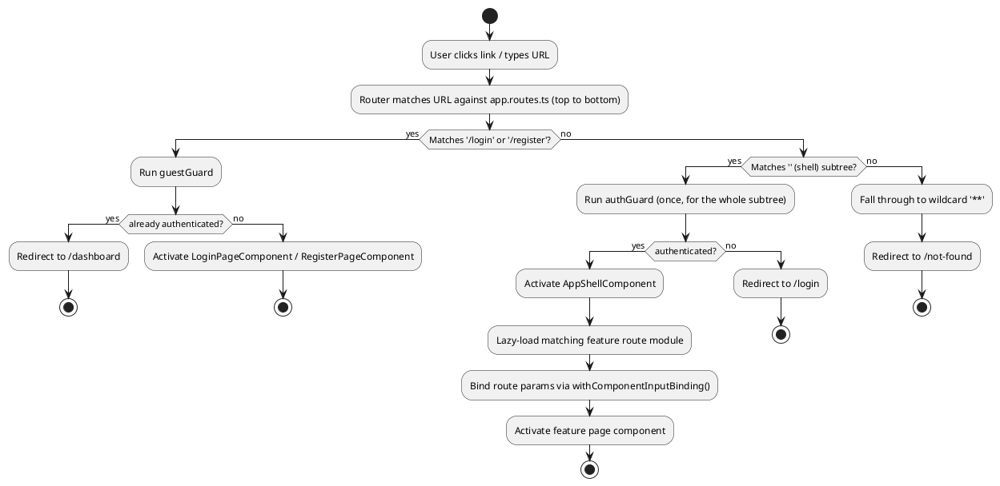

---

# 7. Dependency Injection

## 7.1 `inject()` vs constructor injection

This codebase uses **exclusively** the functional `inject()` API — grep every service and component in `frontend/src/app` and you will not find a single constructor with injected parameters. For example:

```typescript
// frontend/src/app/core/auth/auth.service.ts
export class AuthService {
  private readonly authApi = inject(AuthApiService);
  private readonly tokenStorage = inject(TokenStorageService);
  private readonly router = inject(Router);
  ...
}
```

versus the classic constructor-injection style (valid Angular, just not what's used here):

```typescript
export class AuthService {
  constructor(
    private authApi: AuthApiService,
    private tokenStorage: TokenStorageService,
    private router: Router,
  ) {}
}
```

Both resolve dependencies from the same DI container at construction time; `inject()` is simply callable anywhere *within an injection context* (a constructor, a field initializer, a factory function, `APP_INITIALIZER`, a functional guard/interceptor/resolver) rather than only in a constructor parameter list. This is precisely why functional guards and interceptors (chapters 6, 13) can exist as plain arrow functions instead of injectable classes — `inject()` works inside them because Angular runs them within an injection context, but a constructor-parameter-only approach could not, since a bare function has no constructor.

For a Spring developer: this is roughly the difference between Spring's constructor injection (still the recommended default in Spring) and using `ApplicationContext.getBean(...)` or field-level `@Autowired` — except `inject()` in Angular is not a service-locator anti-pattern, because it is restricted to injection contexts by the framework itself, and static analysis / dev-mode errors loudly if you call it outside one.

## 7.2 Provider scopes

Three distinct provider scopes appear in this codebase:

1. **Root-scoped singletons** — `@Injectable({ providedIn: 'root' })`, used by every API service and by `AuthService`, `TokenStorageService`, `GamificationService`, `ConfirmDialogService`, etc. Angular creates exactly one instance for the whole application, lazily, the first time anything injects it — and because `providedIn: 'root'` also makes the service tree-shakable, a service that's never injected is never even bundled.
2. **Route/component-scoped state services** — `DictionaryListStateService` and `ActiveGameStateService` are annotated with plain `@Injectable()` (**no** `providedIn`) and are instead listed in their owning page component's `providers: [DictionaryListStateService]` array:

   ```typescript
   // frontend/src/app/features/dictionaries/pages/dictionary-list-page/dictionary-list-page.component.ts
   @Component({
     ...
     providers: [DictionaryListStateService],
   })
   export class DictionaryListPageComponent implements OnInit { ... }
   ```

   This creates a **new instance of `DictionaryListStateService` every time `DictionaryListPageComponent` is instantiated**, scoped to that component's injector, and destroyed when the component is destroyed (i.e., when the user navigates away). This is exactly the right choice for page-local UI state (loading flags, current page/sort/filter) that must not leak between visits or be shared across two open instances of the same page.
3. **`InjectionToken` value providers** — `API_BASE_URL` (chapter 3.2), provided once at the root `ApplicationConfig` level.

## 7.3 Comparing to Spring's injection scopes

| Angular | Spring Boot | Lifetime |
|---|---|---|
| `providedIn: 'root'` | `@Service` / `@Component` (default singleton scope) | One instance per application (per browser tab / per JVM) |
| Component `providers: [X]` | `@Scope("prototype")` bean, or a request-scoped bean | New instance per component instance / per HTTP request |
| `InjectionToken` value provider | `@Value` / a `@Bean` returning a primitive/config value | Configuration value, resolved once |

## 7.4 Singleton services and service lifetime in practice

`AuthService.currentUser` — a signal holding the logged-in `User | null` — lives for as long as the `AuthService` singleton lives, which is the entire lifetime of the SPA (from bootstrap until the tab is closed or the app is reloaded). This is what makes `HeaderComponent`'s `@if (authService.currentUser(); as user)` (chapter 12) always reflect the live session, everywhere in the app, without any explicit wiring between the login page and the header — they both simply inject the same singleton.

By contrast, `DictionaryListStateService`'s signals (`loading`, `dictionaries`, `page`, ...) are reset to their initial values every time you navigate away from `/dictionaries` and back, because a fresh instance is created each time. This distinction — root singleton for cross-cutting session/config state, component-scoped instance for page-local UI state — is the project's de facto state management policy, formalized further in chapter 17.

---

# 8. Signals

## 8.1 Why Angular introduced Signals

Historically, Angular's change detection worked by patching every async browser API (`setTimeout`, `addEventListener`, Promise callbacks, XHR) via `zone.js`, then re-checking the *entire component tree* on every such event to see what changed. This works, but it's coarse: Angular can't know in advance which components actually depend on which piece of state, so it must conservatively re-check far more of the tree than necessary, and `zone.js` itself is a large, monkey-patching runtime dependency with real performance and debuggability costs (stack traces through zone-patched async calls are famously ugly).

Signals (stable since Angular 17) solve this by making reactive dependencies **explicit and trackable**: a signal is a wrapped value that notifies exactly the pieces of the app that actually read it when it changes. Angular can then update only the DOM bindings that depend on a specific signal, without walking the whole tree, and eventually without `zone.js` at all (Angular's zoneless mode, which this project doesn't yet enable, but which signals are the prerequisite for).

## 8.2 `signal()`

```typescript
// frontend/src/app/core/auth/auth.service.ts
private readonly currentUserSignal = signal<User | null>(null);
readonly currentUser = this.currentUserSignal.asReadonly();
```

`signal(initialValue)` creates a mutable reactive box. Reading it is a **function call** — `currentUserSignal()` — which is what lets Angular's template compiler track "this template read this signal" without any decorator or subscription. Two ways to change a signal appear throughout the codebase:

```typescript
this.currentUserSignal.set(response.user);                                   // replace outright
this.currentUserSignal.update((user) => (user ? { ...user, displayName } : user)); // derive from current value
```

`.asReadonly()` (used on almost every private signal in this codebase — e.g. `DictionaryListStateService.loading`, `ActiveGameStateService.game`) returns a signal that can be read but not `.set()`/`.update()` from outside the class. This is the signals-era equivalent of exposing a `private final` field only through a getter in Java — it enforces that state mutation is a deliberate, named operation on the owning service (`load()`, `submitAnswer()`, ...), not something any consumer can do by reaching into the signal directly.

## 8.3 `computed()`

```typescript
// frontend/src/app/core/auth/auth.service.ts
readonly isAuthenticated = computed(() => this.currentUserSignal() !== null);
```

```typescript
// frontend/src/app/features/dictionaries/state/dictionary-list-state.service.ts
readonly dictionaries = computed(() => {
  const term = this.searchTermSignal().trim().toLowerCase();
  const filtered = term
    ? this.dictionariesSignal().filter((d) => d.name.toLowerCase().includes(term))
    : this.dictionariesSignal();

  const sort = this.sortSignal();
  if (!sort.active || sort.direction === '') return filtered;

  const factor = sort.direction === 'asc' ? 1 : -1;
  return [...filtered].sort((a, b) => factor * compareValues(a[sort.active], b[sort.active]));
});
```

`computed()` derives a new signal from other signals. Angular automatically tracks that this computation reads `searchTermSignal`, `dictionariesSignal`, and `sortSignal` — no dependency array to maintain by hand (unlike, say, React's `useMemo(fn, [deps])`, where forgetting a dependency is a well-known bug class). The computation is **lazy and memoized**: it only re-runs when one of its actual dependencies changes, and only when something reads it afterward.

`DictionaryListStateService` layers several computed signals on top of each other — `dictionaries` (filtered+sorted), then `isEmpty` and `hasNoSearchResults` both derive from `dictionaries()` and the loading/error/search signals. This is signals used exactly as intended: a small dependency graph of pure derivations sitting on top of a few raw, mutable sources of truth.

## 8.4 `effect()`

Interestingly, **`effect()` does not currently appear anywhere in this codebase.** This is worth stating plainly rather than inventing an example: none of the services or components use `effect()` for side effects tied to signal changes. Every side effect in this project (HTTP calls, navigation, logging) is instead triggered imperatively from an event handler or `ngOnInit`/constructor (e.g., `DictionaryListPageComponent.ngOnInit()` calls `this.state.load()` directly, rather than an `effect()` reacting to some signal). This is a reasonable, common choice — Angular's own guidance is that `effect()` should be reserved for genuine side effects that must run *in response to* signal changes (e.g., syncing to `localStorage`, imperative third-party widget updates), not as a general-purpose replacement for method calls, and this project simply hasn't needed one yet.

If it did, the shape would look like this (illustrative — not code that exists in the repo):

```typescript
constructor() {
  effect(() => {
    console.log('current user changed to', this.currentUser());
  });
}
```

## 8.5 `toSignal()` — bridging RxJS into signals

Two real, working examples exist in the codebase:

```typescript
// frontend/src/app/layout/app-shell/app-shell.component.ts
protected readonly isHandset = toSignal(
  this.breakpointObserver.observe(Breakpoints.Handset).pipe(map((result) => result.matches)),
  { initialValue: false },
);
```

```typescript
// frontend/src/app/features/games/pages/active-game-page/active-game-page.component.ts
protected readonly elapsedSeconds = toSignal(
  timer(0, 1000).pipe(map((tick) => tick)),
  { initialValue: 0 },
);
```

`toSignal()` subscribes to an Observable internally and exposes its latest emission as a signal, automatically unsubscribing when the owning component is destroyed — this is precisely how `AppShellComponent` reacts to viewport size changes (`BreakpointObserver`, from `@angular/cdk/layout`) without a manual `ngOnDestroy`/`Subscription.unsubscribe()` dance, and how `ActiveGamePageComponent` drives a live "seconds elapsed" counter from an RxJS `timer`. `{ initialValue }` is required because a signal must always have *some* value the instant it's created, whereas an Observable might not emit synchronously.

## 8.6 Reactive update flow — sequence diagram

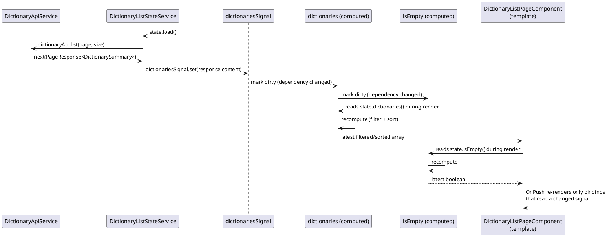

The critical property this diagram shows: `Raw` doesn't push updates to `Template` — nothing is "notified" eagerly. Setting `dictionariesSignal` merely *marks downstream computeds dirty*; the actual recomputation happens lazily, the next time something reads `dictionaries()` or `isEmpty()`, which in practice is during Angular's next change-detection pass for this `OnPush` component.

## 8.7 Signals vs Observables in this codebase — the actual dividing line

The project's own architecture document is explicit (§12): "Angular Signals are used for local application state... RxJS is used only for: HTTP communication, asynchronous streams, retry logic, refresh token flow." The real code follows this closely: every `HttpClient` method returns an `Observable` (chapter 11), and every piece of state derived from those calls is immediately captured into a `signal` inside a `.subscribe({ next: ... })` callback — Observables never leak into templates as the primary state representation (no `| async` pipes appear anywhere in this codebase, in fact — grep confirms it). This is a clean, consistent policy: **RxJS is the transport, Signals are the state.**

---

# 9. Templates

DeutschLingoDeck exclusively uses Angular's newer, Angular-17-and-later **built-in control flow syntax** (`@if`, `@for`, `@switch`) rather than the older `*ngIf`/`*ngFor`/`*ngSwitch` structural directives. Not a single `*ngIf` or `*ngFor` appears anywhere in `frontend/src/app`.

## 9.1 Interpolation

```html
<!-- frontend/src/app/layout/footer/footer.component.ts -->
<p>DeutschLingoDeck &copy; {{ year }}</p>
```

`{{ expression }}` evaluates a template expression (a restricted subset of JavaScript — no assignment, no `new`, no arrow functions) and inserts its string form as text. Because `year` here is a plain class field (not a signal), Angular's change detector re-evaluates this expression on every check cycle for this component — harmless for a value that never changes after construction, and it's `OnPush` besides, so those cycles only occur when something upstream forces one.

## 9.2 Property binding

```html
<!-- frontend/src/app/features/dictionaries/pages/dictionary-list-page/dictionary-list-page.component.html -->
<mat-form-field appearance="outline" class="dictionary-list__search">
  <input matInput [value]="state.searchTerm()" (input)="onSearch($event)" placeholder="Search by name" />
```

`[value]="state.searchTerm()"` binds the DOM element's `value` property (not the HTML attribute) to the current signal value, read as a function call directly inside the template — this is the standard way signals are consumed in templates throughout the app; there is no special "signal binding" syntax, a signal is just called like a getter.

## 9.3 Event binding

```html
(input)="onSearch($event)"
(click)="deleteDictionary(dictionary.id, dictionary.name)"
(matSortChange)="onSort($event)"
```

`(eventName)="handler($event)"` binds a native DOM event (`input`, `click`) or a custom component `output()` (`matSortChange`, emitted by Angular Material's `MatSort` directive) to a component method.

## 9.4 Two-way binding

Interestingly, **`[(ngModel)]` (the classic two-way binding syntax) does not appear anywhere in this codebase** except through the Reactive Forms module's `formControlName`, which is a one-directional-looking binding that Angular's forms machinery makes bidirectional under the hood by wiring both a `valueAccessor` and change events. The one place a *manual* two-way pattern appears is `GameHistoryPageComponent`, which uses `FormsModule` and `[(ngModel)]`-style binding is notably absent even there — it instead reads the native `<select>` change event directly. In short: **this project deliberately favors Reactive Forms over `ngModel` everywhere a form exists** (see chapter 10) — a policy stated directly in the architecture doc (§17: "Template-driven forms should not be used").

## 9.5 `@if`

```html
<!-- frontend/src/app/layout/header/header.component.ts -->
@if (authService.currentUser(); as user) {
  <button matButton [matMenuTriggerFor]="userMenu" type="button" class="header__user">
    <app-avatar [name]="user.displayName" [size]="28" />
    {{ user.displayName }}
  </button>
  ...
}
```

```html
<!-- frontend/src/app/features/games/pages/active-game-page/active-game-page.component.html -->
@if (state.lastValidation(); as validation) {
  ...
} @else {
  <form [formGroup]="answerForm" (ngSubmit)="submitAnswer()" ...> ... </form>
}
```

`@if (expr; as name) { ... } @else { ... }` is both a conditional render **and** a narrowing/aliasing mechanism: inside the block, `user` is guaranteed non-null (TypeScript's control-flow narrowing applies inside the template too), which is why `user.displayName` compiles without an optional-chaining `?.`. This "if-as" pattern — checking a nullable signal and aliasing it in one step — recurs constantly across this codebase (`@if (state.error(); as error)`, `@if (game.currentCard; as card)`, `@if (state.game(); as game)`) and is the primary idiom used for the loading/error/success/empty rendering strategy described in chapter 17.

## 9.6 `@for`

```html
<!-- frontend/src/app/layout/sidebar/sidebar.component.ts -->
@for (item of items; track item.route) {
  <a mat-list-item [routerLink]="item.route" routerLinkActive="sidebar__link--active" (click)="linkClicked.emit()">
    <mat-icon matListItemIcon>{{ item.icon }}</mat-icon>
    <span matListItemTitle>{{ item.label }}</span>
  </a>
}
```

```html
<!-- frontend/src/app/shared/components/breadcrumbs/breadcrumbs.component.ts -->
@for (item of items(); track item.label; let last = $last) {
  @if (item.link && !last) {
    <a class="breadcrumbs__link" [routerLink]="item.link">{{ item.label }}</a>
  } @else {
    <span class="breadcrumbs__current">{{ item.label }}</span>
  }
  @if (!last) { <mat-icon class="breadcrumbs__separator">chevron_right</mat-icon> }
}
```

`track` is **mandatory** in the new syntax (unlike the old `*ngFor`, where `trackBy` was optional and frequently forgotten) — Angular refuses to compile `@for` without it. This single change eliminates an entire class of Angular performance bugs where a list re-renders every DOM node from scratch on every update because the framework has no stable identity to match old items to new ones. `let last = $last` exposes one of `@for`'s built-in contextual variables (`$index`, `$first`, `$last`, `$even`, `$odd`, `$count`) directly, without the old syntax's awkward `let i = index` microsyntax.

## 9.7 `@switch`

Interestingly, **`@switch` does not appear anywhere in this codebase.** Every place that might reach for a switch (e.g. `GameHistoryPageComponent`'s `STATUS_BADGE_VARIANT` record mapping a `GameStatus` to a `BadgeVariant`) instead uses a plain TypeScript lookup object/`Record<K, V>` evaluated in the component class and read in the template via a method call — arguably a cleaner approach than a template `@switch` for this specific case, since it keeps the mapping as testable, typed TypeScript rather than template markup. This is a good example of "if something isn't used, say so" rather than fabricating a `@switch` usage that doesn't exist.

## 9.8 Template reference variables

```html
<!-- frontend/src/app/layout/app-shell/app-shell.component.ts -->
<mat-sidenav #sidenav class="shell__sidenav" [mode]="isHandset() ? 'over' : 'side'" ...>
  <app-sidebar (linkClicked)="isHandset() && sidenav.close()" />
</mat-sidenav>
```

`#sidenav` creates a local template variable referring to the `MatSidenav` directive instance, usable anywhere later in the same template — here, so that clicking a sidebar link on a mobile ("handset") layout can imperatively close the drawer (`sidenav.close()`) without any additional signal or `@ViewChild` wiring in the component class.

## 9.9 Pipes

The only pipe used anywhere in this codebase is Angular's built-in `DatePipe`:

```html
<!-- frontend/src/app/features/dictionaries/pages/dictionary-list-page/dictionary-list-page.component.html -->
<td mat-cell *matCellDef="let dictionary">{{ dictionary.createdAt | date: 'mediumDate' }}</td>
```

...imported as a standalone directive directly in the component's `imports` array (`imports: [DatePipe, ...]`) — pipes are standalone-importable exactly like components and directives now. No custom pipes exist in this project (there is no `shared/pipes` folder despite one being mentioned in the architecture spec — see chapter 2.1).

Note also the one place `*matCellDef` (an Angular Material *structural directive*, not Angular's own control flow) appears above — Angular Material's `mat-table` predates the new `@for`/`@if` syntax and still exposes its per-cell/per-row templates through the classic `*directive` microsyntax. This is a case where the new control-flow syntax and the old structural-directive syntax legitimately coexist in the same file, because `mat-table`'s row/column templating is a library API contract, not application-level conditional rendering.

## 9.10 Old syntax vs. new syntax — summary

| Concept | Old (not used here) | New (used throughout DeutschLingoDeck) |
|---|---|---|
| Conditional | `*ngIf="x"` / `*ngIf="x; else y"` | `@if (x) { } @else { }` |
| Loop | `*ngFor="let i of items; trackBy: fn"` | `@for (i of items; track i.id) { }` |
| Switch | `[ngSwitch]` / `*ngSwitchCase` | `@switch` / `@case` (unused in this project) |
| Local var from loop index | `let i = index` | `let i = $index` (built-in) |
| Mandatory tracking | optional, easy to forget | mandatory — won't compile without it |

---

# 10. Forms

## 10.1 Why Reactive Forms

The architecture document is explicit: "Template-driven forms should not be used" (§17). Reactive Forms builds the form model — `FormGroup`, `FormControl`, validators — in the **component class**, as plain TypeScript objects, with the template only binding to that pre-built model. This is more code up front than template-driven forms' `[(ngModel)]` shorthand, but it buys fully synchronous, testable, strongly-typed access to form state and validity without touching the DOM — a natural fit for a codebase that already leans on strong typing everywhere else.

## 10.2 `FormBuilder` and typed, non-nullable groups

```typescript
// frontend/src/app/features/authentication/pages/login-page/login-page.component.ts
private readonly formBuilder = inject(FormBuilder);

protected readonly form = this.formBuilder.nonNullable.group({
  email: ['', [Validators.required, Validators.email]],
  password: ['', [Validators.required]],
});
```

`FormBuilder` is injected like any other service — Angular Forms is not special-cased. `.nonNullable.group({...})` (used in **every** form in this codebase — login, register, active-game answer, dictionary import, profile, password change) builds a `FormGroup` whose `.value`/`.getRawValue()` is typed *without* `| null` on each field, because `.reset()` on a non-nullable control restores the initial value rather than `null`. This matters in practice: `this.form.getRawValue()` can be passed directly as a `LoginRequest` to `AuthService.login()` without any manual null-checking or casting, because TypeScript already knows every field is a `string`, never `string | null`.

## 10.3 Validators, including a real custom cross-field validator

Built-in validators used throughout: `Validators.required`, `Validators.email`, `Validators.minLength(n)`, `Validators.maxLength(n)`. The one genuinely custom validator in the codebase:

```typescript
// frontend/src/app/shared/utils/password-match.validator.ts
export function passwordsMatchValidator(
  passwordControlName: string,
  confirmControlName: string,
): ValidatorFn {
  return (group: AbstractControl): ValidationErrors | null => {
    const password = group.get(passwordControlName)?.value;
    const confirmPassword = group.get(confirmControlName)?.value;
    if (!password || !confirmPassword || password === confirmPassword) return null;
    return { passwordMismatch: true };
  };
}
```

This is a **validator factory** — a function that takes configuration (which two control names to compare) and returns a `ValidatorFn`, rather than being a `ValidatorFn` itself. This makes it reusable across both places it's actually used: `RegisterPageComponent`'s `password`/`confirmPassword` pair, and `ProfilePageComponent`'s `newPassword`/`confirmNewPassword` pair, with different control names each time:

```typescript
// register-page.component.ts
this.formBuilder.nonNullable.group(
  { displayName: [...], email: [...], password: [...], confirmPassword: [...] },
  { validators: passwordsMatchValidator('password', 'confirmPassword') },
);
```

Because this is a **group-level validator** (passed in the second argument to `.group()`, not attached to a single control), it runs against the whole `FormGroup` and can read both controls' values — a single-control `ValidatorFn` has no way to see a sibling control's value.

## 10.4 Form groups and form arrays

`FormGroup` is used throughout (every form in the app is a flat or nested `FormGroup`). **`FormArray` does not appear anywhere in this codebase** — there is no dynamically-sized list of form controls anywhere (e.g., no "add another tag" repeatable-field UI). Worth noting honestly rather than fabricating an example: if the dictionary card editor ever needed a variable number of "accepted answers" as individual editable text inputs (currently `acceptedAnswers?: string[]` on `CardRequest` is just a plain array field, not exposed as an editable form yet — see chapter 16), `FormArray` would be the natural tool, but that UI does not currently exist.

## 10.5 Walking through the Login page as the canonical example

```typescript
// frontend/src/app/features/authentication/pages/login-page/login-page.component.ts
export class LoginPageComponent {
  protected readonly submitting = signal(false);
  protected readonly authError = signal<string | null>(null);

  protected readonly form = this.formBuilder.nonNullable.group({
    email: ['', [Validators.required, Validators.email]],
    password: ['', [Validators.required]],
  });

  protected submit(): void {
    if (this.form.invalid || this.submitting()) {
      this.form.markAllAsTouched();
      return;
    }
    this.submitting.set(true);
    this.authError.set(null);

    this.authService.login(this.form.getRawValue()).subscribe({
      next: () => this.router.navigateByUrl('/dashboard'),
      error: (error: AppError) => {
        this.submitting.set(false);
        this.authError.set(error.message ?? 'Invalid email or password.');
      },
    });
  }
}
```

```html
<!-- login-page.component.html -->
<form [formGroup]="form" (ngSubmit)="submit()" class="auth-page__form">
  <mat-form-field appearance="outline">
    <mat-label>Email</mat-label>
    <input matInput type="email" formControlName="email" autocomplete="email" />
    @if (form.controls.email.hasError('required')) { <mat-error>Email is required.</mat-error> }
    @if (form.controls.email.hasError('email')) { <mat-error>Enter a valid email address.</mat-error> }
  </mat-form-field>
  ...
  <button matButton="filled" type="submit" [disabled]="submitting()">
    @if (submitting()) { <mat-progress-spinner diameter="20" mode="indeterminate" /> } @else { Login }
  </button>
</form>
```

This single component demonstrates the project's complete, repeated form pattern:

1. `[formGroup]="form"` binds the whole template to the class-built `FormGroup`; `formControlName="email"` binds one input to one control.
2. `(ngSubmit)="submit()"` — not `(click)` on the button — so pressing <kbd>Enter</kbd> in any field submits the form too, for free.
3. **Guard clause first**: `if (this.form.invalid || this.submitting())` bails out immediately and calls `markAllAsTouched()` so validation messages appear even if the user never focused-then-blurred each field (Angular only shows `mat-error` once a control is "touched" by default).
4. Two signals (`submitting`, `authError`) model the async lifecycle explicitly — this is the project's standard four-state form pattern (initial → submitting → success-navigates-away → failure-shows-error), matching the architecture doc's §20 loading strategy almost verbatim.
5. `form.controls.email.hasError('required')` — the typed `.controls` accessor (available because of `.nonNullable.group`'s strong typing) lets the template check specific validator keys individually, so each failure mode gets its own message.

## 10.6 Spring Boot comparison

| Angular Reactive Forms | Spring Boot / Bean Validation |
|---|---|
| `Validators.required`, `.email()`, `.minLength()` | `@NotNull`, `@Email`, `@Size(min=...)` on a DTO field |
| Custom `ValidatorFn` (`passwordsMatchValidator`) | Custom class-level `@Constraint` / `ConstraintValidator` |
| `form.invalid` checked client-side before submit | `@Valid @RequestBody` triggers `MethodArgumentNotValidException` server-side |
| `AppError.fieldErrors` displayed next to fields | `ErrorResponse.errors: List<FieldError>` — see chapter 16 |

The crucial point: **both layers validate independently, and the frontend never trusts its own validation as sufficient.** Every submit handler's `error: (error: AppError) => ...` branch exists specifically because the backend can still reject a request the frontend's own `Validators` considered valid (e.g., "email already registered," which no client-side rule can know in advance).

---

# 11. HTTP Communication

## 11.1 `HttpClient`, configured with `withFetch()`

```typescript
provideHttpClient(withFetch(), withInterceptors([authInterceptor, errorInterceptor, refreshTokenInterceptor]))
```

`withFetch()` switches `HttpClient`'s internal transport from the classic `XMLHttpRequest` to the browser's native `fetch()` API — mainly relevant because `fetch` is what Angular's SSR runtime can execute on the Node.js server (chapter 23), where `XMLHttpRequest` doesn't exist at all. Nothing about how you *use* `HttpClient` from a service changes; it's purely a backend-of-the-client-library detail.

## 11.2 Observables, not Promises

Every feature API service method returns an RxJS `Observable`, never a `Promise`:

```typescript
// frontend/src/app/features/dictionaries/services/dictionary-api.service.ts
@Injectable({ providedIn: 'root' })
export class DictionaryApiService {
  private readonly http = inject(HttpClient);
  private readonly baseUrl = inject(API_BASE_URL);

  list(page = 0, size = 20): Observable<PageResponse<DictionarySummary>> {
    const params = new HttpParams().set('page', page).set('size', size);
    return this.http.get<PageResponse<DictionarySummary>>(`${this.baseUrl}/dictionaries`, { params });
  }
  ...
}
```

Angular's `HttpClient` returns a **cold** Observable: the HTTP request is only actually sent when something calls `.subscribe()` — building the Observable does nothing by itself. This is the single most common Angular pitfall for developers coming from `fetch`/`axios` (where the call fires immediately): forgetting to subscribe means the request simply never happens, silently.

## 11.3 Typed responses

Every service method is generic over the exact response DTO shape (`Observable<PageResponse<DictionarySummary>>`, `Observable<DictionaryDetail>`, `Observable<void>` for deletes) — `HttpClient.get<T>()`/`post<T>()` cast the parsed JSON to `T` at the type level (this is a compile-time assertion, not runtime validation — nothing checks at runtime that the backend actually sent a `DictionarySummary`-shaped object; the guarantee comes from both sides agreeing on the OpenAPI contract, `docs/DeutschLingoDeck - OpenApi Specification - v1.yaml`).

## 11.4 Request lifecycle, end to end

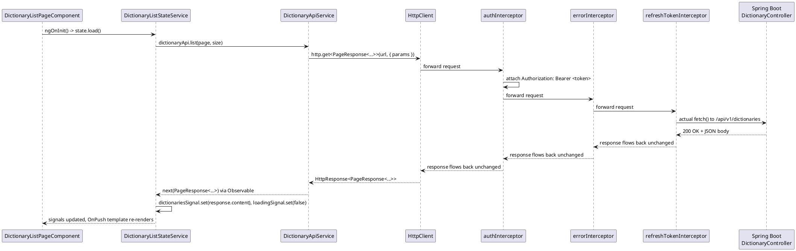

## 11.5 Error handling — where it happens and why

Notice the diagram above: none of the three interceptors do anything *to the request* on the way back except `refreshTokenInterceptor`, and only on failure. Error handling in this project is layered:

1. **Interceptor level** (chapter 13) — normalizes any `HttpErrorResponse` into a project-wide `AppError` shape (`errorInterceptor`), and transparently retries once after a token refresh on 401 (`refreshTokenInterceptor`) — both *before* the error ever reaches a component.
2. **Component level** — every `.subscribe({ next, error })` call in every page component supplies an `error` callback typed as `(error: AppError) => void`, because by the time it reaches the component, `errorInterceptor` has already guaranteed that shape.
3. **Unhandled/non-HTTP level** (chapter 14) — `GlobalErrorHandler` catches anything that still slips through uncaught (a `TypeError` in a template expression, for instance), so a single bug can't blank the whole page.

## 11.6 Sequence diagram: full request/response including UI states

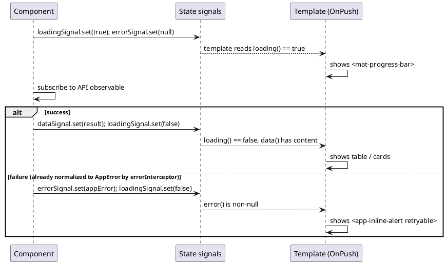

---

# 12. Authentication

## 12.1 The three cooperating pieces

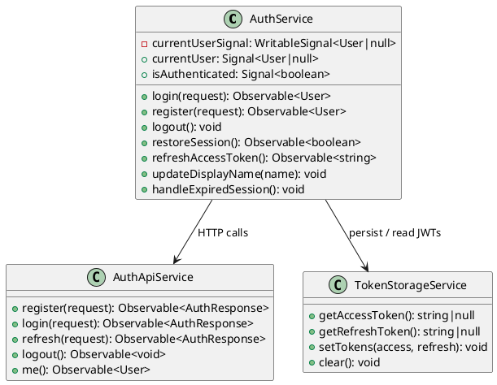

`AuthApiService` is pure HTTP plumbing (five methods, one per backend auth endpoint, mirroring `AuthenticationController`'s five `@PostMapping`/`@GetMapping` handlers 1-for-1). `TokenStorageService` wraps `localStorage`, guarded by `isPlatformBrowser(inject(PLATFORM_ID))` so it's a safe no-op during server-side rendering (chapter 23) where no `localStorage` exists. `AuthService` is the orchestrator holding the actual reactive session state (the `currentUserSignal`) that the rest of the app reads.

## 12.2 Login flow

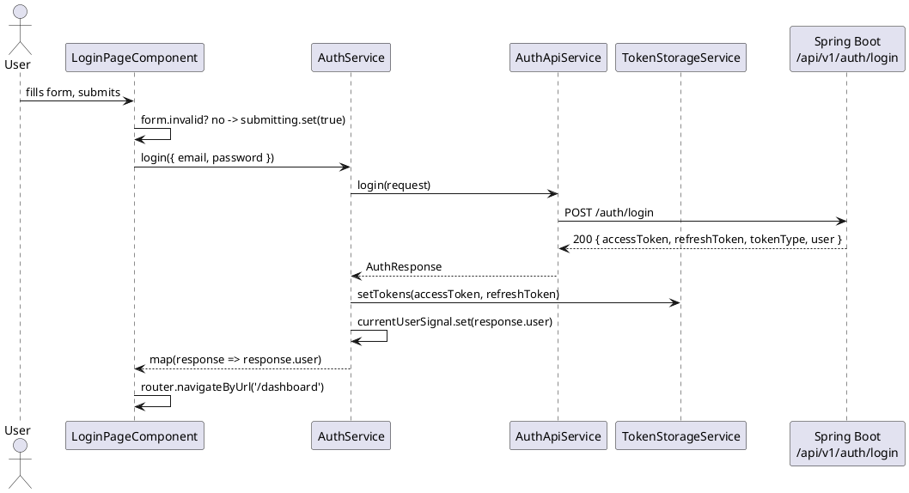

## 12.3 Session restoration (bootstrap) and a real bug worth understanding

```typescript
// frontend/src/app/core/auth/auth.service.ts
restoreSession(): Observable<boolean> {
  if (!this.tokenStorage.getAccessToken()) {
    return of(false);
  }

  return this.authApi.me().pipe(
    tap((user) => this.currentUserSignal.set(user)),
    map(() => true),
    catchError(() => {
      this.refreshAccessToken().pipe(
        switchMap(() => this.authApi.me()),
        tap((user) => this.currentUserSignal.set(user)),
        map(() => true),
        catchError(() => {
          this.clearSession();
          return of(false);
        })
      )
      this.clearSession();
      return of(false);
    }),
  );
}
```

Read this closely, because it is a genuine, currently-present bug and an excellent real-world lesson (this document is meant to describe the code as it actually is, not as it should be). Inside the outer `catchError`, a *second* Observable chain is constructed — `this.refreshAccessToken().pipe(...)` — but it is **never returned and never subscribed to**. RxJS Observables are lazy; building a `.pipe(...)` chain and not returning/subscribing it means none of that code ever runs. Execution falls straight through to the next two lines, `this.clearSession(); return of(false);`, **unconditionally**, every single time `GET /auth/me` fails during bootstrap — regardless of whether a token refresh would have succeeded.

The practical consequence: **`restoreSession()`'s own refresh-and-retry path is currently dead code.** In practice this is largely masked because `refreshTokenInterceptor` (chapter 13) *also* intercepts a 401 on this same `/auth/me` call at the HTTP layer and can retry it — but only if the interceptor's refresh succeeds before `authApi.me()`'s outer `catchError` runs its (buggy) fallback; if the interceptor's own refresh attempt also fails, or the initial error isn't a 401 at all, the session is cleared unconditionally with no second chance. This is flagged here rather than silently "fixed" in the narrative, per this guide's own rule: describe what exists, note explicitly what doesn't work as intended. Chapter 29 (Common Mistakes) returns to this exact snippet as the canonical example of an "orphaned Observable chain."

## 12.4 Logout flow

```typescript
logout(): void {
  this.authApi.logout().pipe(catchError(() => of(void 0))).subscribe(() => {
    this.clearSession();
    this.router.navigateByUrl('/login');
  });
}
```

Notice `catchError(() => of(void 0))` before `.subscribe()`: even if the backend's `POST /auth/logout` call fails (network error, already-expired token, server down), the client still clears its local session and navigates to `/login` — logout is treated as a client-side guarantee that must always succeed from the user's point of view, regardless of whether the backend's own token invalidation succeeds. This is a deliberate and correct choice: a user must never be "stuck" logged in locally just because a logout network call failed.

## 12.5 JWT + refresh token flow, end to end

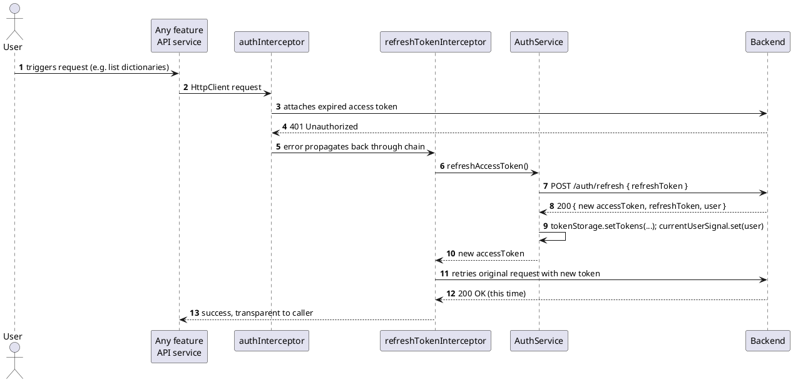

If the refresh call itself fails (refresh token also expired/invalid):

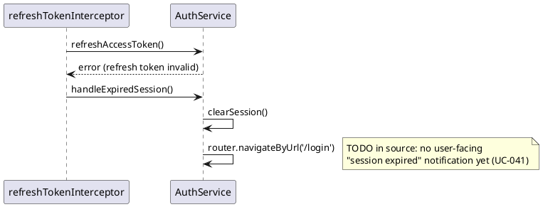

## 12.6 Guards, revisited in the context of auth

`authGuard` and `guestGuard` (chapter 6.4) both read `authService.isAuthenticated()` — a plain synchronous signal read, not an HTTP call — so route guarding is instant and never blocks on a network round trip. This only works correctly *because* `APP_INITIALIZER` (chapter 3.3) already resolved the session before the router ever evaluates its first guard.

---

# 13. Interceptors

## 13.1 The three interceptors and why their order is exactly `[auth, error, refresh]`

```typescript
withInterceptors([authInterceptor, errorInterceptor, refreshTokenInterceptor])
```

Angular's functional interceptor chain behaves like middleware in an onion: for the **outgoing request**, interceptors run in the array's order (`authInterceptor` first, `refreshTokenInterceptor` last, closest to the actual network call); for the **incoming response or error**, they run in **reverse order** (`refreshTokenInterceptor` sees it first, `authInterceptor` last). This project's ordering is not arbitrary — it depends on this exact reversal:

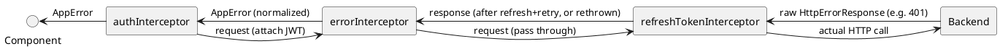

- **`authInterceptor` first (outermost)** — must run before anything else on the way out, since every other interceptor and the backend itself depend on the `Authorization` header already being attached.
- **`refreshTokenInterceptor` last (innermost)** — must be the *first* to see the response on the way back, because its logic explicitly checks `error instanceof HttpErrorResponse && error.status === 401` (`frontend/src/app/core/interceptors/refresh-token.interceptor.ts`). If `errorInterceptor` ran first on the way back (i.e., were listed after `refreshTokenInterceptor` in the array), it would already have converted the raw `HttpErrorResponse` into an `AppError`, and `refreshTokenInterceptor`'s `instanceof HttpErrorResponse` check would never match — silently disabling the entire refresh-and-retry flow. **This is precisely why ordering matters here**, not just as a general principle but as a specific, verifiable dependency between two files in this repository.
- **`errorInterceptor` in the middle** — runs after the refresh attempt has already had its chance to succeed and retry transparently, so a component only ever sees `errorInterceptor`'s normalized `AppError` for failures that survived the refresh attempt (or weren't 401s to begin with).

## 13.2 `authInterceptor`

```typescript
// frontend/src/app/core/interceptors/auth.interceptor.ts
const PUBLIC_ENDPOINTS = ['/auth/register', '/auth/login', '/auth/refresh'];

export const authInterceptor: HttpInterceptorFn = (req, next) => {
  const tokenStorage = inject(TokenStorageService);
  const isPublicEndpoint = PUBLIC_ENDPOINTS.some((endpoint) => req.url.includes(endpoint));
  const accessToken = tokenStorage.getAccessToken();

  if (isPublicEndpoint || !accessToken) return next(req);

  return next(req.clone({ setHeaders: { Authorization: `Bearer ${accessToken}` } }));
};
```

A `HttpInterceptorFn` is a plain function `(req, next) => Observable<HttpEvent>` — the functional replacement for the older class-based `HttpInterceptor` interface (`intercept(req, next): Observable<...>`). `req.clone({ setHeaders })` is required because `HttpRequest` objects are **immutable** — there is no way to mutate `req.headers` in place; every interceptor that needs to change a request must clone it. Note the explicit skip-list: without it, the login/register/refresh calls would try to attach a (possibly stale or nonexistent) access token to the very requests whose job is to *obtain* one.

## 13.3 `errorInterceptor`

```typescript
// frontend/src/app/core/interceptors/error.interceptor.ts
export const errorInterceptor: HttpInterceptorFn = (req, next) =>
  next(req).pipe(
    catchError((error: unknown) => {
      if (!(error instanceof HttpErrorResponse)) return throwError(() => error);
      return throwError(() => toAppError(error));
    }),
  );

function toAppError(error: HttpErrorResponse): AppError {
  const body = error.error as Partial<ApiErrorResponse> | undefined;
  if (error.status === 0) {
    return { status: 0, code: 'NETWORK_ERROR', message: 'Unable to reach the server.' };
  }
  return {
    status: error.status,
    code: body?.code ?? 'UNKNOWN_ERROR',
    message: body?.message ?? 'An unexpected error occurred.',
    correlationId: body?.correlationId,
    fieldErrors: body?.errors,
  };
}
```

`error.status === 0` specifically detects the browser's own transport failure (DNS failure, CORS rejection, server unreachable, no network) — this never comes from the Spring Boot backend at all, since the backend always returns a real HTTP status if it responds. This is the one branch that fires when the Spring Boot process is simply not running.

## 13.4 `refreshTokenInterceptor`

Already shown in chapter 12.5. One more detail worth surfacing: the code comment on this file is explicit about a known limitation —

```typescript
/**
 * TODO: concurrent requests failing at the same time will each trigger their
 * own refresh call. A shared in-flight refresh Observable should be
 * introduced before production to guarantee refresh-token rotation is only
 * triggered once per expiry.
 */
```

If five parallel requests all fail with 401 at once (e.g., the dashboard's `loadStatistics()`, `loadDictionaries()`, `loadActiveGame()`, `loadGamification()` all firing together on page load — see chapter 15), each independently calls `authService.refreshAccessToken()`, meaning up to five separate `POST /auth/refresh` calls race the backend simultaneously. If the backend rotates (invalidates) the refresh token on each use — a common and recommended security practice — the second-and-later calls would fail with an already-consumed refresh token, causing spurious logouts under exactly this kind of concurrent-request burst. This is documented in the source as a known, not-yet-addressed gap, and is worth remembering in chapter 22 (Performance) and chapter 29 (Common Mistakes) as well.

## 13.5 Execution order illustrated end-to-end

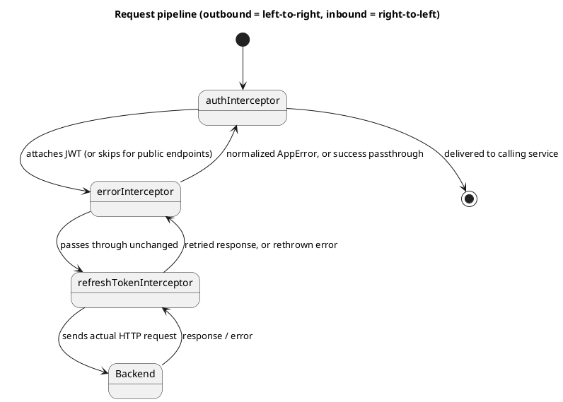

---

# 14. Error Handling

## 14.1 `GlobalErrorHandler`

```typescript
// frontend/src/app/core/services/global-error-handler.ts
@Injectable()
export class GlobalErrorHandler implements ErrorHandler {
  handleError(error: unknown): void {
    // TODO: forward to a remote logging/monitoring service.
    console.error('Unhandled application error:', error);
  }
}
```

Registered via `{ provide: ErrorHandler, useClass: GlobalErrorHandler }` in `app.config.ts`, this replaces Angular's default `ErrorHandler`, which otherwise just `console.error`s and moves on — functionally, this override does exactly the same thing today, but it exists as the single, correct seam to later add real error-reporting (Sentry, a custom `/api/v1/client-errors` endpoint, etc.) without touching any other file. It is explicitly scoped to **non-HTTP** errors — a template expression throwing, a bug in a signal `computed()`, an uncaught synchronous exception anywhere in component code. HTTP errors never reach this handler under normal circumstances, because `errorInterceptor` (chapter 13.3) always converts them into a typed `AppError` that flows through a `.subscribe({ error })` callback instead of being thrown as an unhandled exception.

## 14.2 HTTP errors

Already covered in depth in chapter 13.3 (`errorInterceptor`) and chapter 12.3/13.4 (`refreshTokenInterceptor`'s 401 handling). The summary: every HTTP failure a component ever sees has already been normalized to `AppError { status, code, message, correlationId?, fieldErrors? }`.

## 14.3 Routing errors

The router's own error path is simply the wildcard route: `{ path: '**', redirectTo: 'not-found' }` (chapter 6.5). There is no explicit `withNavigationErrorHandler` or router `errorHandler` configured — a lazy-loaded chunk failing to download (e.g., a stale cached `index.html` referencing a deleted hashed bundle after a deploy) is not specifically caught anywhere beyond the browser's own unhandled-rejection path, which flows into `provideBrowserGlobalErrorListeners()` → `GlobalErrorHandler`.

## 14.4 User notifications

This is one of the more honestly-flagged gaps in the codebase. `AuthService.handleExpiredSession()` contains the comment:

```typescript
// TODO: surface a "session expired" notification once a notification
// mechanism is introduced (UC-041).
```

There is, in fact, **no toast/snackbar/notification service anywhere in this project** — not `MatSnackBar`, not a custom equivalent. Every "failure" state the user sees is either an inline `<app-inline-alert>` banner sitting in the page (chapter 15, 20) or a form-level error message signal (chapter 10) — both are *in-page*, persistent-until-retried states, not ephemeral pop-up notifications. This is a legitimate, working pattern for this app's needs so far, but it means events like "your session just expired and you were redirected to login" currently happen silently, with no explanation shown to the user at the destination page.

## 14.5 The three-tier error handling model, visualized

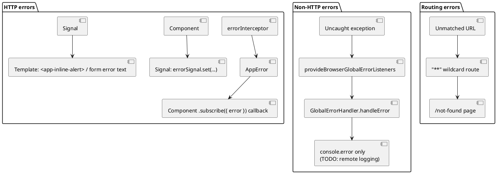

## 14.6 Spring Boot comparison

| Angular | Spring Boot |
|---|---|
| `errorInterceptor` normalizing `HttpErrorResponse` → `AppError` | `@ControllerAdvice` + `@ExceptionHandler` normalizing exceptions → `ErrorResponse` |
| `GlobalErrorHandler` (`ErrorHandler` override) | A catch-all handler for `Exception.class` in `@ControllerAdvice`, or an uncaught-exception hook |
| Wildcard route → `/not-found` | `NoHandlerFoundException` → custom 404 response |

---

# 15. Services

## 15.1 Why business/data-access logic lives in services, not components

Every page component in this codebase follows the same rule, stated directly in the architecture doc (§25): "Never call HttpClient directly from components." Grep confirms it — `HttpClient` is `inject()`ed only inside files under `services/` (or `core/auth`); no `*.component.ts` file in the entire `features/` tree injects `HttpClient` directly. Components instead inject a feature API service (`DictionaryApiService`, `GameApiService`, `StatisticsApiService`, `GamificationService`, `ProfileApiService`, `AuthApiService`) and call typed methods on it.

This buys two things a Spring Boot developer will recognize immediately: **testability** (a component can be tested against a mocked service interface without any HTTP machinery), and **single-responsibility separation** — a component's job is presentation and user interaction; a service's job is knowing the URL shape, request/response DTOs, and query parameters for one backend resource.

## 15.2 Two kinds of services in this codebase

1. **Stateless API services** (`providedIn: 'root'`) — one HTTP method per backend endpoint, no internal mutable state, e.g. `DictionaryApiService`, `GameApiService`. These map almost 1:1 onto their corresponding Spring `@RestController` (`DictionaryController`, `GameController`).
2. **Stateful state services** (component-`providers`-scoped) — `DictionaryListStateService`, `ActiveGameStateService` (chapter 8, chapter 17) — hold signals and orchestrate calls to an API service, translating raw HTTP responses into page-ready reactive state (loading/error/computed derivations).

Not every page uses a dedicated state service, though — `DashboardPageComponent`, `ProfilePageComponent`, and `GameHistoryPageComponent` all keep their signals directly on the component class instead of extracting a separate state service. This is a real, visible inconsistency in the codebase (chapter 17 discusses when this is and isn't appropriate) rather than a hard rule — smaller pages with 2–4 signals and no reusable derivation logic don't clearly benefit from the extra indirection of a separate injectable class.

## 15.3 Communication between services

Services in this codebase don't call each other directly very often — most cross-service composition actually happens **in the component**, via RxJS combinators, not inside one service calling another. `DashboardPageComponent` is the clearest example:

```typescript
// frontend/src/app/features/dashboard/pages/dashboard-page/dashboard-page.component.ts
constructor() {
  this.loadStatistics();     // StatisticsApiService
  this.loadDictionaries();   // DictionaryApiService
  this.loadActiveGame();     // GameApiService
  this.loadGamification();   // GamificationService, via forkJoin
}

protected loadGamification(): void {
  forkJoin({
    levelProgress: this.gamificationApi.getLevelProgress(),
    dailyGoal: this.gamificationApi.getDailyGoal(),
    achievements: this.gamificationApi.getAchievements(),
  }).subscribe({
    next: ({ levelProgress, dailyGoal, achievements }) => { ... },
    error: () => { ... },
  });
}
```

`forkJoin` runs three independent HTTP calls in parallel and waits for all three to complete (or any one to error) before emitting a single combined result — the RxJS equivalent of Java's `CompletableFuture.allOf(...)`. `DictionaryImportPageComponent.addGeneratedToDictionary()` (chapter 16) shows the *sequential*-dependency counterpart, using `switchMap` to create a dictionary and only then fire the card-creation calls that depend on its generated ID — the RxJS equivalent of chaining `.thenCompose(...)`.

## 15.4 A representative full-service walkthrough: `DictionaryApiService`

```typescript
@Injectable({ providedIn: 'root' })
export class DictionaryApiService {
  private readonly http = inject(HttpClient);
  private readonly baseUrl = inject(API_BASE_URL);

  list(page = 0, size = 20): Observable<PageResponse<DictionarySummary>> { ... }
  create(request: CreateDictionaryRequest): Observable<DictionaryDetail> { ... }
  import(request: DictionaryImportRequest): Observable<DictionaryImportResponse> {
    const formData = new FormData();
    formData.append('file', request.file);
    formData.append('name', request.name);
    ...
    return this.http.post<DictionaryImportResponse>(`${this.baseUrl}/dictionaries/import`, formData);
  }
  getById(dictionaryId: number): Observable<DictionaryDetail> { ... }
  update(dictionaryId: number, request: UpdateDictionaryRequest): Observable<DictionaryDetail> { ... }
  delete(dictionaryId: number): Observable<void> { ... }
  listCards(dictionaryId: number, page = 0, size = 20, filter?: CardFilter): Observable<PageResponse<CardSummary>> { ... }
  getCard(dictionaryId: number, cardId: number): Observable<CardDetail> { ... }
  createCard(dictionaryId: number, request: CardRequest): Observable<CardDetail> { ... }
  updateCard(dictionaryId: number, cardId: number, request: CardRequest): Observable<CardDetail> { ... }
  deleteCard(dictionaryId: number, cardId: number): Observable<void> { ... }
}
```

Eleven methods, one 1:1 with each REST endpoint under `/api/v1/dictionaries` that `DictionaryController` exposes on the backend. `import()` is worth a specific note: it builds a `FormData` (multipart) body by hand rather than a JSON body, because the backend endpoint accepts a file upload alongside form fields — `HttpClient` automatically sets the correct `multipart/form-data` `Content-Type` (with boundary) when given a `FormData` body, without any interceptor or manual header code needed.

## 15.5 Package diagram: feature services and their consumers

```plantuml
@startuml
package "features/dictionaries" {
  [DictionaryApiService]
  [DictionaryListStateService] --> [DictionaryApiService]
}
package "features/games" {
  [GameApiService]
  [ActiveGameStateService] --> [GameApiService]
}
package "features/statistics" { [StatisticsApiService] }
package "features/gamification" { [GamificationService] }
package "features/profile" { [ProfileApiService] }
package "features/ai-assistant" { [AiAssistantService] }

[DashboardPageComponent] --> [StatisticsApiService]
[DashboardPageComponent] --> [DictionaryApiService]
[DashboardPageComponent] --> [GameApiService]
[DashboardPageComponent] --> [GamificationService]

[DictionaryImportPageComponent] --> [DictionaryApiService]
[DictionaryImportPageComponent] --> [AiAssistantService]

[ProfilePageComponent] --> [ProfileApiService]
[ProfilePageComponent] --> [GamificationService]
@enduml
```

---

# 16. Models

## 16.1 DTOs and interfaces

Every request/response shape exchanged with the backend is a plain TypeScript `interface`, never a `class`. For example:

```typescript
// frontend/src/app/core/models/user.model.ts
export interface User {
  id: number;
  email: string;
  displayName: string;
}
```

```typescript
// frontend/src/app/features/dictionaries/models/card.model.ts
export interface CardSummary {
  id: number;
  cardType: CardType;
  article?: string | null;
  sourceText: string;
  primaryTranslation?: string;
  position: number;
}

export interface CardDetail extends CardSummary {
  acceptedAnswers?: string[];
  example?: string | null;
  notes?: string | null;
  difficultyLevel?: number | null;
  tags?: string[];
}
```

`CardDetail extends CardSummary` mirrors the backend's own summary-vs-detail DTO split (a common REST pattern: list endpoints return a lean summary shape, single-resource endpoints return the full detail shape) — and TypeScript's structural interface extension expresses "detail is a superset of summary" precisely.

## 16.2 Enums — and a deliberate departure from TypeScript's `enum` keyword

```typescript
// frontend/src/app/features/dictionaries/models/card-type.enum.ts
export type CardType = 'WORD' | 'NOUN' | 'VERB' | 'PHRASE' | 'SENTENCE';
```

Despite the filename (`card-type.enum.ts`) and despite Java engineers reaching instinctively for TypeScript's `enum` keyword to mirror a Java `enum`, this project uses **string literal union types** instead, everywhere (`GameStatus`, `ValidationResult`, `CardType`, `CardFilterStatus`, `InlineAlertTone`, `BadgeVariant`). This is a widely-recommended TypeScript pattern, not an inconsistency: a `type` union of string literals compiles to *nothing at all* at runtime (pure compile-time checking, zero bundle-size cost), serializes to/from JSON transparently as plain strings (matching exactly what the Spring backend sends — e.g., `"status": "FINISHED"` — with no numeric-vs-string enum mapping ambiguity), and — unlike a real TypeScript `enum` — has no separate runtime object with its own footguns (numeric enums being bidirectionally mapped, `const enum` inlining issues with certain build tools). Java's `enum` is a genuine runtime type with methods and identity; TypeScript's `enum` tries to imitate that and inherits real rough edges as a result. A string literal union is the more idiomatic TypeScript choice specifically *because* Java's model doesn't translate cleanly.

## 16.3 Type safety at the HTTP boundary

```typescript
// frontend/src/app/shared/models/page-response.model.ts
export interface PageResponse<T> {
  page: number;
  size: number;
  totalElements: number;
  totalPages: number;
  content: T[];
}
```

A single generic wrapper interface, reused for `PageResponse<DictionarySummary>`, `PageResponse<CardSummary>`, `PageResponse<LearningHistoryEntry>`, `PageResponse<GameSummary>` — mirroring Spring Data's `Page<T>` (or a custom paginated response wrapper) on the backend. This is TypeScript generics doing exactly the same job Java generics do: one type definition, reused and specialized per call site, with the compiler enforcing that `response.content` is actually an array of the right element type.

## 16.4 Comparison with Java DTOs

| TypeScript (frontend) | Java (backend, e.g. `authentication/dto`) |
|---|---|
| `interface User { id: number; email: string; displayName: string; }` | `public record UserResponse(Long id, String email, String displayName) {}` or a POJO with getters |
| `interface CardDetail extends CardSummary { ... }` | DTO inheritance / composition, or MapStruct-mapped hierarchy |
| `type GameStatus = 'CREATED' | 'STARTED' | ...` | `public enum GameStatus { CREATED, STARTED, IN_PROGRESS, FINISHED, ABANDONED }` |
| `PageResponse<T>` | `Page<T>` (Spring Data) or a custom generic wrapper |
| Structural typing (any object with the right shape satisfies the interface) | Nominal typing (must explicitly be declared as that type) |

The last row is the deepest actual difference, and worth internalizing: TypeScript's type system is **structural** — any object literal with the right fields satisfies `User`, with no `implements User` declaration required anywhere. Java's type system is **nominal** — a class must explicitly declare `implements`/`extends` the type to satisfy it. This is why services in this codebase can freely return plain object literals cast to an interface type without ever "constructing" a `User` — there's no constructor to call in the first place; the interface is erased entirely at compile time (`tsc` deletes it — no `User.class` exists at runtime the way `User.class` does in the JVM).

---

# 17. State Management

## 17.1 What "state" means in this application, concretely

Two categories exist, per the architecture doc (§12) and confirmed by the actual code:

- **Global state** — exactly one thing: `AuthService.currentUser`/`isAuthenticated` (chapter 7.4, chapter 12). Everything else that might look "global" (API base URL) is static configuration, not mutable state.
- **Local/feature state** — everything else: loading flags, the currently loaded page of data, sort/filter selections, form submission status. Each feature owns its own, and nothing outside that feature reads it directly.

## 17.2 Two concrete state patterns coexist in this codebase

**Pattern A — dedicated state service**, used by `DictionaryListPageComponent` (via `DictionaryListStateService`) and `ActiveGamePageComponent` (via `ActiveGameStateService`). The state service is provided at the component level (chapter 7.2), owns the signals, exposes `computed()` derivations, and offers named mutation methods (`load()`, `setSearchTerm()`, `submitAnswer()`). The page component becomes a thin consumer: `protected readonly state = inject(DictionaryListStateService);` and template bindings like `state.dictionaries()`, `state.loading()`.

**Pattern B — signals directly on the component**, used by `DashboardPageComponent`, `ProfilePageComponent`, and `GameHistoryPageComponent`. For example, `DashboardPageComponent` declares nine separate signals (`statistics`, `statisticsLoading`, `statisticsError`, `dictionaries`, `dictionariesLoading`, ..., `gamificationLoading`) directly as component fields, with `protected loadStatistics(): void { ... }`-style methods living right there in the component class.

This is a real, visible inconsistency, not a deliberate two-tier design documented anywhere — the architecture doc doesn't distinguish "when to extract a state service." In practice, though, the dividing line that emerges from the code itself is reasonable: pages with **derived/computed** state worth memoizing and reusing (search+sort filtering in the dictionary list, a game's progress percentage) extract a state service; pages that are mostly **independent parallel loads with no cross-derivation** (the dashboard's four unrelated data sources) don't gain much from the extra indirection and keep it inline. When reviewing or extending this codebase, that's the practical heuristic to apply, even though it isn't written down anywhere as a rule.

## 17.3 Why no NgRx

The architecture doc is direct: "NgRx should not be introduced in the MVP" (§12). NgRx (Angular's most common Redux-style state library) buys you: a single global store, time-travel debugging, strict unidirectional data flow, and — critically — a disciplined way to share state across *many* unrelated parts of a *large* application. DeutschLingoDeck's actual state footprint doesn't need that: there is exactly one genuinely global, cross-cutting piece of mutable state (the authenticated user), and it already has a perfectly adequate home in a single `@Injectable({ providedIn: 'root' })` service with two signals. Every other piece of state is naturally scoped to one page and destroyed when that page is left — the problem NgRx exists to solve (untangling state shared across many disconnected features) simply doesn't arise yet.

## 17.4 When NgRx (or a similar library) would become worth it

Concretely, for this codebase, the tipping point would be when state genuinely needs to survive **across independent feature boundaries** or be **shared without a common parent component to hold it** — for example:
- If the active game's progress needed to be visible simultaneously in the header (a persistent "resume game" chip) *and* the dashboard *and* the game page itself, all needing to react to the same updates without one owning the others.
- If the dictionary list needed optimistic updates visible from multiple entry points (e.g., a global "recently viewed dictionaries" widget) that must stay in sync with the list page's own local edits.
- If undo/redo, state persistence across reloads, or devtools time-travel debugging became actual product requirements rather than nice-to-haves.

None of these currently exist in DeutschLingoDeck. Introducing NgRx today would mean paying its boilerplate cost (actions, reducers, effects, selectors) for a problem the current signal-based approach already solves more simply.

## 17.5 State flow diagram — the two patterns side by side

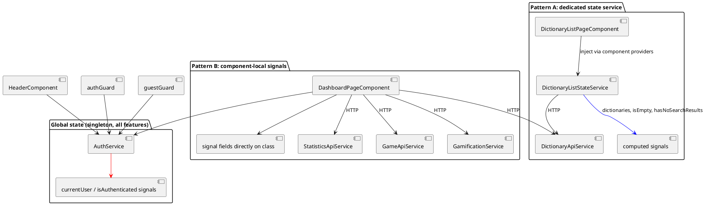

---

# 18. Shared Module Pattern vs Standalone Architecture

## 18.1 Historical Angular evolution

Angular's component model went through three broad eras:

1. **AngularJS (1.x)** — controllers + `$scope`, no module system resembling modern Angular at all.
2. **Angular 2–14, "NgModule era"** — every component/directive/pipe declared in exactly one `NgModule`; features organized as `FeatureModule`s importing `SharedModule`s and `CoreModule`s; the root `AppModule` importing everything transitively needed at startup, plus lazy-loaded feature modules via `loadChildren: () => import('./feature.module').then(m => m.FeatureModule)`.
3. **Angular 14+ (standalone), the default from Angular 19+, and the only style used here** — components declare their own dependencies via `imports: [...]` directly; `bootstrapApplication()` replaces `bootstrapModule()`; `loadComponent`/`loadChildren` (with a routes array, not a module) replace module-based lazy loading.

## 18.2 Modules vs Standalone Components, compared directly

| | NgModule era | Standalone (DeutschLingoDeck) |
|---|---|---|
| Declaring a component's template dependencies | In the owning `NgModule`'s `declarations`+`imports` | In the component's own `@Component({ imports: [...] })` |
| Root bootstrap | `platformBrowserDynamic().bootstrapModule(AppModule)` | `bootstrapApplication(App, appConfig)` |
| Lazy-loaded feature | `loadChildren: () => import('./feature.module').then(m => m.FeatureModule)` | `loadChildren: () => import('./feature.routes').then(m => m.FEATURE_ROUTES)` |
| Sharing reusable UI | `SharedModule` re-exporting components/directives/pipes | Import the specific standalone component directly wherever needed |
| Extra indirection to reason about | Yes — "which module declares this component? which modules does that module import?" | No — a component's `imports` array is the complete, local answer |
| Tree-shaking of unused Material sub-modules | Harder — a `SharedModule` re-exporting `MatButtonModule` pulls it into every module that imports `SharedModule`, whether it uses buttons or not | Easier — each component imports exactly the Material modules its own template uses |

DeutschLingoDeck has **zero `NgModule`s anywhere** in `frontend/src/app` — not even a residual `SharedModule` for Material re-exports (a common transitional pattern in codebases migrating gradually). Every component, including every Material-heavy page, lists its own precise `imports` array. This is a genuinely clean, "done" standalone migration rather than a hybrid.

## 18.3 Why this matters practically

The most concrete benefit visible in this codebase: `AvatarComponent` has **no `imports` array at all**, because it uses no other Angular building blocks — under the module era, it would still have had to be *declared* in some `NgModule`, and that module would need `exports: [AvatarComponent]` for `HeaderComponent` to use it, and `HeaderComponent`'s own module would need to `import` that module. Three files' worth of bookkeeping collapses to: `HeaderComponent`'s `@Component({ imports: [..., AvatarComponent] })` line, and nothing else.

---

# 19. Styling

## 19.1 Component CSS (encapsulated)

Covered in depth in chapter 4.3 — each component's `styles`/`styleUrl` is scoped via Angular's emulated view encapsulation. Style files in this codebase range from fully inline template-literal `styles:` (small components) to dedicated `.css` files (page components, e.g. `login-page.component.css`, `dictionary-list-page.component.css`).

## 19.2 Global styles

Registered in `angular.json`:

```json
"styles": ["src/material-theme.scss", "src/styles.css"]
```

`frontend/src/styles.css` and `frontend/src/material-theme.scss` are the only two style sources loaded outside any component's encapsulation boundary — everything global (resets, the Material theme mixin) lives here; everything else stays local.

## 19.3 Angular Material theming

```scss
// frontend/src/material-theme.scss
@use '@angular/material' as mat;

html {
  height: 100%;
  @include mat.theme((
    color: (primary: mat.$azure-palette, tertiary: mat.$blue-palette),
    typography: Roboto,
    density: 0,
  ));
}

body {
  color-scheme: light;
  background-color: var(--mat-sys-surface);
  color: var(--mat-sys-on-surface);
  font: var(--mat-sys-body-medium);
  margin: 0;
  height: 100%;
}
```

This is Angular Material's **Material Design 3 ("M3")** theming API — `mat.theme(...)` is a single Sass mixin that generates the full set of CSS custom properties (`--mat-sys-primary`, `--mat-sys-on-surface`, `--mat-sys-surface-variant`, etc.) every Material component (and, deliberately, this project's own custom components too — see `SidebarComponent`'s `.sidebar__link--active { background: var(--mat-sys-secondary-container); }`) reads at runtime. This is a significant simplification versus the older M2 theming API, which required manually defining and combining separate primary/accent/warn palettes and calling several different mixins.

`color-scheme: light` pins the app to light mode explicitly — the architecture doc lists "Dark Mode" under §23 Future Enhancements, explicitly out of scope for the current build, which this one line directly enforces.

## 19.4 Responsive layout

Handled in exactly one place structurally — `AppShellComponent`'s use of `BreakpointObserver` (chapter 4, chapter 8.5) to switch the sidenav between `mode="side"` (permanent, desktop) and `mode="over"` (overlay drawer, mobile/tablet) — plus ordinary CSS media queries for smaller adjustments, e.g. `HeaderComponent`'s:

```css
@media (min-width: 960px) {
  .header__menu-toggle { display: none; }
}
```

## 19.5 Common styling mistake this project avoids

A frequent Angular Material mistake is hardcoding colors instead of theme tokens, which breaks the moment a theme or palette changes. This codebase is disciplined about it in the shell/layout/shared components (`var(--mat-sys-primary)`, `var(--mat-sys-on-surface-variant)`, etc.) — though not perfectly: `InlineAlertComponent`'s warning tone and `BadgeComponent`'s success/warning/danger/info variants use **hardcoded hex colors** (`#fbe7c6`, `#6b4a00`, `#d3ead9`, `#f8d7da`, ...) rather than theme tokens. This is worth flagging as a real, minor inconsistency: if the app ever added a dark theme or changed its color palette, these specific hardcoded values would not adapt automatically the way every `var(--mat-sys-*)`-based style elsewhere would.

---

# 20. Angular Material

## 20.1 Why it was selected

Angular Material is the official Google-maintained component library for Angular, implementing Material Design out of the box, guaranteed to stay compatible with the Angular version it ships alongside (both are on `^22.0.0` here) — removing an entire category of third-party-library-version-compatibility risk. For a small team building a full-featured app quickly (tables, dialogs, navigation, forms), it removes the need to design and build a component library from scratch.

## 20.2 Every Material module actually used in this codebase

Grepping every component's `imports` array across the project surfaces this concrete list:

| Module | Where it's used |
|---|---|
| `MatToolbarModule` | `HeaderComponent` |
| `MatSidenavModule` | `AppShellComponent` |
| `MatListModule` | `SidebarComponent` (nav list), `DictionaryImportPageComponent` |
| `MatButtonModule` | Nearly every page (`matButton`, `matButton="filled"`, `matButton="outlined"`) |
| `MatIconModule` | Nearly every page (Material Symbols ligature icons: `menu`, `logout`, `search`, `delete`, ...) |
| `MatMenuModule` | `HeaderComponent` (user menu), `DictionaryListPageComponent` (row action menu) |
| `MatCardModule` | Auth pages, `StatCardComponent`, `ActiveGamePageComponent` |
| `MatFormFieldModule` / `MatInputModule` | Every Reactive Form |
| `MatProgressSpinnerModule` | Login/Register submit buttons |
| `MatProgressBarModule` | Dashboard stats, active game progress/timer, dictionary list loading |
| `MatTableModule` / `MatPaginatorModule` / `MatSortModule` | Dictionary list, game history |
| `MatTooltipModule` | Row action buttons, dashboard cards |
| `MatDialogModule` | `ConfirmDialogComponent` |
| `MatSelectModule` | Game history status filter, dictionary import language/level selects |
| `MatTabsModule` | `DictionaryImportPageComponent` |

Not used anywhere: `MatSlideToggle`, `MatCheckbox`, `MatRadio`, `MatStepper`, `MatExpansionPanel`, `MatChips`, `MatDatepicker`, `MatSnackBar` (chapter 14.4 already noted the absence of any snackbar/notification usage), `MatBadge` (the project has its own hand-rolled `BadgeComponent` instead of Material's badge directive — see below).

## 20.3 Customization

Two custom components in `shared/components` deliberately **reimplement** functionality Angular Material already offers, rather than using the Material equivalent:

- `BadgeComponent` (chapter 16.2, 19.5) — a small pill-shaped label with five variants — versus Material's own `matBadge` directive (which is designed for small overlay counters/dots on another element, a genuinely different use case; a status pill like "FINISHED"/"ABANDONED" isn't really what `matBadge` is for, so this is a reasonable, deliberate choice, not a redundant reinvention).
- `AvatarComponent` (chapter 4.1, 7) — initials-based colored circle avatar, entirely custom (Angular Material has no avatar component at all — this fills a genuine gap in the library).

## 20.4 A representative Material-heavy template

The dictionary list page (chapter 8-adjacent, chapter 15) combines seven Material modules in one template — form field + input for search, table + paginator + sort for the data grid, menu for row actions, progress bar for loading, tooltip for the actions button — which is a good single reference point for how densely this project leans on Material for anything resembling a data-management screen.

---

# 21. Guards

## 21.1 `AuthGuard`

Already shown in full in chapter 6.4. Execution flow when a request targets any authenticated route:

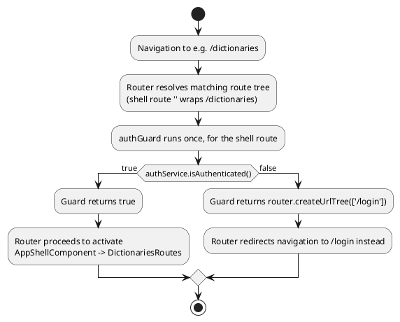

## 21.2 `GuestGuard`

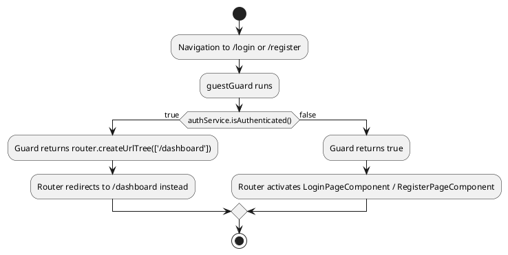

## 21.3 Why both guards exist as a pair

Without `guestGuard`, an already-authenticated user who manually navigates to `/login` would see the login form rendered on top of a valid session — confusing and pointless. Without `authGuard`, an unauthenticated user could type `/dictionaries` directly into the address bar and at least briefly see (or attempt to load data into) a page meant only for logged-in users. Together they make the two halves of the route table (`AUTHENTICATION_ROUTES` vs. the guarded `''` shell subtree) mutually exclusive from the user's perspective — you can only ever be looking at one half or the other.

## 21.4 Spring Security comparison

| Angular Guard | Spring Security equivalent |
|---|---|
| `authGuard` (`CanActivateFn`) | A `SecurityFilterChain` rule like `.requestMatchers("/api/**").authenticated()`, or a custom `OncePerRequestFilter` |
| `guestGuard` | Less common server-side, but analogous to redirecting an already-authenticated session away from `/login` in a traditional MVC app |
| `router.createUrlTree(['/login'])` | `response.sendRedirect("/login")` / a Spring Security `AuthenticationEntryPoint` |

The key structural difference: Angular guards run **entirely client-side**, purely to control what the SPA *renders* — they provide zero actual security on their own. The real security boundary is still the Spring Boot backend's own JWT validation (`backend/src/main/java/com/deutschlingodeck/security`) and `authInterceptor`'s attached bearer token; a user could bypass `authGuard` trivially by editing client-side JavaScript, but they still could not get a single byte of real data back from `DictionaryController` without a valid JWT the backend itself verifies. Guards are a UX convenience, not a security mechanism — worth stating explicitly since it's a common point of confusion for backend engineers new to SPA architecture.

---

# 22. Performance

## 22.1 Lazy loading, revisited with numbers in mind

Chapter 6.3 already covered the mechanism. The measurable effect: `angular.json`'s production budget explicitly caps the **initial** bundle:

```json
"budgets": [
  { "type": "initial", "maximumWarning": "500kB", "maximumError": "1MB" },
  { "type": "anyComponentStyle", "maximumWarning": "4kB", "maximumError": "8kB" }
]
```

Because every feature (`dashboard`, `dictionaries`, `games`, `statistics`, `profile`) is behind `loadChildren`, none of their code counts toward this "initial" budget — only the root shell, the auth pages, and the router/HTTP/DI machinery itself do. The build will hard-fail (`maximumError`) if that shrinking initial bundle ever creeps past 1MB, and warn past 500kB — a concrete, enforced guardrail, not just a style preference.

## 22.2 Tree shaking

Two mechanisms compound here: (1) `providedIn: 'root'` services are only bundled if something actually injects them — `AiAssistantService`'s stub methods (chapter 12/15) would be entirely absent from the production bundle if nothing imported `DictionaryImportPageComponent`, since that's currently the only consumer; and (2) standalone components' explicit per-component `imports` arrays (chapter 4, 18) mean a page that only needs `MatButtonModule` never pulls in the rest of Angular Material transitively the way a monolithic `SharedModule` import could.

## 22.3 Standalone-specific optimization

Because there's no `NgModule` graph to resolve, Angular's compiler (and bundler, via esbuild under `@angular/build`) can reason about dependencies at the level of individual components rather than whole module subtrees — this is part of why standalone + `esbuild`-based builds (the default builder in `angular.json`'s `"builder": "@angular/build:application"`) produce measurably smaller and faster-to-build bundles than the older module-based, webpack-based pipeline for equivalent code.

## 22.4 Signals and change detection

Chapter 8 already covered the mechanics. The performance payoff specifically: because every component in this codebase is `ChangeDetectionStrategy.OnPush` (chapter 4.2) and local state is signal-based, Angular's change detector can, in principle, skip re-checking entire subtrees that have no reason to have changed — e.g., typing in the dictionary search box (`DictionaryListStateService.searchTermSignal`) only invalidates the `dictionaries`/`isEmpty`/`hasNoSearchResults` computeds and whatever part of the template reads them; `HeaderComponent`, `SidebarComponent`, `FooterComponent` — siblings in the tree with no dependency on that signal — are never asked to re-render at all.

## 22.5 Bundle size — what's actually shipped

`package.json`'s dependency list (chapter 1.4) is deliberately minimal: no charting library, no date library (`Intl`/`DatePipe` cover the one date-formatting need), no state management library, no UI library beyond Angular Material/CDK, no HTTP client beyond the built-in one. The three custom chart components under `shared/components/chart-bar`, `chart-donut`, `chart-line` (used for statistics/dashboard visualizations) are hand-rolled rather than pulled from a charting library — keeping a potentially heavy dependency (a full charting library) out of the bundle entirely for what are, evidently, fairly simple visualizations.

## 22.6 What isn't optimized (stated honestly)

There is no `@defer` block anywhere in this codebase (Angular's newer template-level deferred-loading directive for below-the-fold or rarely-needed template regions, distinct from route-level lazy loading) — every component that's rendered is rendered eagerly once its route activates; no additional deferral happens *within* a page. For the current page complexity (a handful of cards, one table, one form per page) this is a reasonable omission, not a pressing gap — `@defer` earns its complexity on much heavier pages than any that exist here today.

---

# 23. SSR

## 23.1 What's actually configured

DeutschLingoDeck uses `@angular/ssr` with Express (`frontend/src/server.ts`), and — critically — a deliberately **hybrid** rendering strategy, not full SSR of the whole app:

```typescript
// frontend/src/app/app.routes.server.ts
/**
 * Authenticated routes depend on a JWT stored in localStorage, which does not
 * exist during server-side rendering. They are therefore rendered client-side
 * only (RenderMode.Client). Public, data-free routes are safe to prerender.
 */
export const serverRoutes: ServerRoute[] = [
  { path: 'login', renderMode: RenderMode.Prerender },
  { path: 'register', renderMode: RenderMode.Prerender },
  { path: 'access-denied', renderMode: RenderMode.Prerender },
  { path: 'not-found', renderMode: RenderMode.Prerender },
  { path: '**', renderMode: RenderMode.Client },
];
```

The comment in the source states the reasoning plainly, and it's worth internalizing precisely because it explains a design decision that might otherwise look like a missing feature: `TokenStorageService` (chapter 12.1) reads `localStorage`, which simply does not exist in Node.js. Any route whose rendering depends on knowing who's logged in (which, in this app, is *every* route behind the `authGuard` shell — dashboard, dictionaries, games, statistics, profile) cannot be meaningfully server-rendered without a completely different auth-token strategy (e.g., an HttpOnly cookie readable during SSR — noted as a future consideration in `TokenStorageService`'s own TODO comment, chapter 12). So the wildcard `'**'` — covering the *entire* authenticated application — is explicitly `RenderMode.Client`: the server sends a near-empty shell for those URLs, and Angular renders everything in the browser exactly as a traditional SPA would, with no server involvement beyond serving static assets.

Only four routes get real, build-time **prerendering** (`RenderMode.Prerender` — Angular generates static HTML for these pages once, at build time, since they need no per-request data): `login`, `register`, `access-denied`, `not-found`. These four are public, contain no user-specific or backend-fetched data, and benefit the most from prerendering (fastest possible first paint, works with JavaScript disabled, ideal for SEO if this app were ever public-facing).

## 23.2 Hydration

`provideClientHydration()` (chapter 3.2) is what makes prerendering actually useful rather than counterproductive: without it, Angular would discard the server-rendered DOM for `/login` and rebuild it from scratch in the browser (a "destructive" render), which not only wastes the work already done server-side but causes a visible flicker as the real page replaces the prerendered one. With hydration enabled, Angular instead **reuses** the exact DOM nodes the server produced, attaching event listeners and reactive bindings to the existing markup in place.

## 23.3 The actual rendering process, end to end

```plantuml
@startuml
actor Browser
participant "Express server\n(server.ts)" as Express
participant "AngularNodeAppEngine" as Engine
participant "Angular (server bundle)" as SSR

== Request for a prerendered route (e.g. /login) ==
Browser -> Express: GET /login
Express -> Engine: angularApp.handle(req)
Engine -> Browser: pre-built static HTML (built at compile time, no work at request time)
Browser -> Browser: hydrate — reuse existing DOM, attach listeners

== Request for any authenticated route (e.g. /dashboard) ==
Browser -> Express: GET /dashboard
Express -> Engine: angularApp.handle(req)
Engine -> SSR: RenderMode.Client for '**' -> minimal shell only
SSR --> Browser: mostly-empty HTML + client bundle reference
Browser -> Browser: full client-side bootstrap (main.ts flow, chapter 3)\nAPP_INITIALIZER restores session from localStorage\nrouter renders AppShellComponent -> DashboardPageComponent
@enduml
```

## 23.4 Benefits and drawbacks, as they actually apply here

**Benefits realized today:** the four public/error pages get instant first paint and are crawlable/inspectable without executing JavaScript — meaningful for `/login` specifically, since it's the very first thing an unauthenticated visitor's browser has to render.

**Drawbacks/limitations, stated plainly:** the vast majority of the application's actual value (dashboard, dictionaries, games, statistics, profile — everything a logged-in user spends their time on) gets **no SSR benefit whatsoever** — it is `RenderMode.Client`, i.e., a conventional client-rendered SPA experience, with the usual cost of a blank-then-populated first paint while the client bundle downloads, parses, and bootstraps. `server.ts` itself is still essentially the unmodified Angular CLI scaffold — its commented-out "Example Express REST API endpoints can be defined here" block confirms no custom server-side logic (an API proxy, server-side data prefetching, etc.) has been added; it purely serves the browser bundle and delegates rendering to `AngularNodeAppEngine`.

## 23.5 What would be needed to SSR the authenticated app

Purely informational, since it does not exist today: moving the JWT to an HttpOnly cookie (readable by the Node SSR process via the incoming request) instead of `localStorage`, then changing `serverRoutes` to something like `RenderMode.Server` (dynamic, per-request SSR, re-run on every request rather than prerendered once) for the authenticated subtree, and ensuring every service that currently assumes a browser (`TokenStorageService`'s `isPlatformBrowser` guard, chapter 12.1) has a working server-side code path instead of a no-op.

---

# 24. Docker

## 24.1 The frontend Dockerfile — what it actually is

```dockerfile
# frontend/Dockerfile
FROM node:22-alpine

WORKDIR /app

COPY package*.json ./
RUN npm install

COPY . .

EXPOSE 4200

CMD ["npm", "start", "--", "--host", "0.0.0.0"]
```

This is a **single-stage development container**, not a production build. `npm start` runs `ng serve` (per `package.json`'s `scripts.start`), Angular's dev server — the same tool a developer would run locally with `ng serve`, just inside a container instead of on the host machine. `--host 0.0.0.0` is required specifically because the dev server defaults to binding only to `localhost`, which would be unreachable from outside the container without it.

## 24.2 `docker-compose.yml` — how it's actually wired up

```yaml
frontend:
  build:
    context: ./frontend
  container_name: deutschlingodeck-frontend
  ports:
    - "4200:4200"
  volumes:
    - ./frontend:/app
    - /app/node_modules
  depends_on:
    - backend
```

The `volumes` entry is the tell: `./frontend:/app` bind-mounts the **host's source directory over the container's `/app`**, so edits made on the host are immediately visible inside the running container — this is exactly what `ng serve`'s live-reload watches for. The second volume entry, `/app/node_modules` (an anonymous volume with no host path), exists specifically to *prevent* the bind mount above from also hiding the container's own `node_modules` (installed during `RUN npm install` at build time) behind the host's — which likely doesn't have `node_modules` installed at all, or has a platform-mismatched one (e.g., built on macOS, run in a Linux container). This two-volume combination is the standard Docker Compose pattern for "mount my source, but keep the container's own installed dependencies."

Also present in the compose file: `postgres` (with a healthcheck the `backend` service depends on via `condition: service_healthy`), `pgadmin`, `backend` (built from `./backend`, a Gradle/Spring Boot Dockerfile), and — notably — a `plantuml` service (`plantuml/plantuml-server:jetty`) exposed on port 8085, which exists specifically so this project's own PlantUML diagrams (like every diagram in this document) can be rendered locally without depending on a public PlantUML rendering server.

## 24.3 Development vs. production containers — stated honestly

There is **no production Dockerfile for the frontend** in this repository. A real production build would typically be multi-stage: an initial stage running `ng build` (producing optimized, hashed, minified bundles under `dist/frontend-app/browser` and, if SSR is used, `dist/frontend-app/server`), and a second, much smaller final stage — either an `nginx:alpine` image serving the static `browser` output, or a `node:22-alpine` image running only `node dist/frontend-app/server/server.mjs` (the `serve:ssr:frontend-app` script already defined in `package.json`, ready to use, just not yet wired into any Dockerfile). Today, the only Dockerfile that exists runs the *development* server, unoptimized, with source mounted live — appropriate for local `docker compose up` development, but this compose file and Dockerfile combination should not be read as, or repurposed directly into, a production deployment.

## 24.4 Deployment topology, as it exists

```plantuml
@startuml
node "Docker host" {
  node "postgres container" as PG
  node "pgadmin container" as PGA
  node "backend container\n(Spring Boot, Gradle)" as BE
  node "frontend container\n(ng serve, dev mode)" as FE
  node "plantuml container" as PU
}
actor Developer

Developer --> FE : http://localhost:4200
FE --> BE : http://localhost:8080/api/v1 (per environment.ts)
BE --> PG : JDBC, depends_on: service_healthy
PGA --> PG : admin UI, http://localhost:5050
Developer --> PU : http://localhost:8085 (render .puml files)
@enduml
```

---

# 25. Frontend–Backend Communication

## 25.1 The full path, end to end

```plantuml
@startuml
actor Browser
participant "Angular Component" as Ng
participant "Feature API Service" as Svc
participant "HttpClient +\nInterceptor chain" as Http
participant "Spring Boot\nController" as Ctrl
participant "Spring Boot\nService layer" as Svc2
participant "Spring Data\nRepository" as Repo
database "PostgreSQL" as DB

Browser -> Ng: user action (click, submit, navigate)
Ng -> Svc: call typed method, e.g. dictionaryApi.list(0, 20)
Svc -> Http: http.get<PageResponse<...>>(url, { params })
Http -> Http: authInterceptor attaches JWT
Http -> Ctrl: HTTP GET /api/v1/dictionaries?page=0&size=20
Ctrl -> Ctrl: @Valid request binding, JWT auth filter
Ctrl -> Svc2: delegate to DictionaryService
Svc2 -> Repo: findByOwner(...), paginated query
Repo -> DB: SQL SELECT ... LIMIT/OFFSET
DB --> Repo: rows
Repo --> Svc2: entities
Svc2 --> Ctrl: mapped DTOs
Ctrl --> Http: 200 OK, JSON body
Http -> Http: errorInterceptor / refreshTokenInterceptor pass through (no error)
Http --> Svc: typed PageResponse<DictionarySummary>
Svc --> Ng: Observable emits, .subscribe({ next }) fires
Ng -> Ng: signal.set(response.content) (or state service does)
Ng --> Browser: OnPush template re-renders affected DOM only
@enduml
```

## 25.2 Each hop, briefly, with its file reference

- **Browser → Angular**: a click/submit handler defined in a page component, e.g. `DictionaryListPageComponent.onPage()`.
- **Angular → Interceptor**: the feature service (`DictionaryApiService`) never sees the interceptor chain directly — it's transparently applied to every `HttpClient` call by `provideHttpClient(withInterceptors([...]))` (chapter 13).
- **Interceptor → Spring Boot**: the actual network call, landing on `DictionaryController` (`backend/src/main/java/com/deutschlingodeck/dictionary/controller/DictionaryController.java`), whose `@RequestMapping` base path matches `API_BASE_URL` + the service's URL suffix exactly (`/dictionaries`).
- **Spring Boot → Database**: standard Spring layering (`Controller` → `Service` → `Repository` → JPA/Hibernate → PostgreSQL), outside this document's scope but structurally mirrored by the frontend's own `page → service` layering (chapter 15).
- **Response → UI update**: the signal-based reactive update flow already diagrammed in chapter 8.6.

## 25.3 Contract enforcement

Both ends of this chain are kept honest by the same document: `docs/DeutschLingoDeck - OpenApi Specification - v1.yaml`. The frontend's TypeScript interfaces (chapter 16) and the backend's DTOs (`backend/src/main/java/com/deutschlingodeck/*/dto`) are two independent, hand-written implementations of the same OpenAPI contract — there is no code generation step tying them together automatically (no `openapi-generator` step in `package.json`'s scripts), so keeping them in sync is a manual discipline, not a build-time guarantee. This is worth knowing if a field is ever renamed on one side without the other being updated — nothing in the build will catch that mismatch; it will only surface at runtime as a missing/undefined field.

---

# 26. Application Lifecycle

## 26.1 The complete scenario, traced through real files

This chapter narrates the exact journey the prompt's suggested structure asks for, tying together every previous chapter's diagram into one continuous story, using the dashboard as the concrete destination.

```plantuml
@startuml
title Complete Application Lifecycle — Open Browser to Automatic UI Refresh

|Browser|
start
:Open browser to https://app/dashboard;

|Angular Bootstrap (ch. 3)|
:Load index.html, execute main.ts;
:bootstrapApplication(App, appConfig);
:Register all providers (router, HttpClient+interceptors,\nAPI_BASE_URL, GlobalErrorHandler);
:Run APP_INITIALIZER -> AuthService.restoreSession();
if (access token present in localStorage?) then (yes)
  :GET /auth/me succeeds;
  :currentUserSignal.set(user);
else (no / me fails)
  :session stays null (ch. 12.3 notes the\nrestoreSession refresh-retry bug here);
endif

|Routing (ch. 6)|
:Router matches '/dashboard' against app.routes.ts;
:authGuard evaluates isAuthenticated();
if (authenticated) then (yes)
  :Activate AppShellComponent (lazy-loaded);
  :Lazy-load dashboard.routes.ts -> DASHBOARD_ROUTES;
  :Activate DashboardPageComponent;
else (no)
  :Redirect to /login instead — scenario ends here;
  stop
endif

|Authentication already resolved (ch. 12)|
:HeaderComponent reads authService.currentUser()\nrenders name + avatar;

|Dashboard (ch. 15, 17)|
:constructor() fires four independent loads:\nloadStatistics(), loadDictionaries(),\nloadActiveGame(), loadGamification();
:Each sets its own *Loading signal true,\ntemplate shows progress indicators;

|HTTP + Interceptors (ch. 11, 13)|
:Four parallel HttpClient calls go through\nauthInterceptor -> errorInterceptor -> refreshTokenInterceptor;

|Backend + Database|
:Spring Boot controllers handle each request;
:Repositories query PostgreSQL;
:JSON responses return;

|Signals + Rendering (ch. 8, 22)|
:Each response .set()s its corresponding signal(s);
:OnPush change detection re-renders only the\naffected stat cards / lists, nothing else;

|User Action|
:User clicks "Start Game" on a dictionary row;
:router.navigate(['/game/start'], { queryParams: { dictionaryId } });

|New HTTP Request (ch. 11, 25)|
:StartGamePageComponent creates a game via GameApiService;
:Request flows through the same interceptor chain;
:Backend creates a Game row, returns its id;

|Signal Update (ch. 8)|
:router.navigate(['/game', game.id]);
:ActiveGamePageComponent's gameId input bound\nautomatically via withComponentInputBinding() (ch. 6.6);
:ActiveGameStateService.load(gameId) fetches the game;
:gameSignal.set(game);

|Automatic UI Refresh|
:Template re-renders the current card, progress bar,\nand timer — driven entirely by signal reads,\nno manual DOM manipulation anywhere;
stop
@enduml
```

## 26.2 What this trace demonstrates

Every arrow in this diagram corresponds to a real file already discussed in an earlier chapter — nothing here is invented to make the story flow. The point of walking through it end-to-end is to make visible something easy to miss when studying each mechanism in isolation: **bootstrapping, routing, guards, signals, interceptors, and Angular Material are not separate features bolted together — they are one continuous pipeline**, each stage's output becoming the next stage's input, from the moment a URL is typed to the moment a validated answer's feedback appears on screen.

---

# 27. UML Diagrams — Index

This document contains a PlantUML diagram accompanying nearly every major concept, rather than collecting them separately. For reference, here is the complete index of diagrams by type and location:

| Type | Diagrams | Chapters |
|---|---|---|
| Package diagram | Project package structure | 2.2 |
| Sequence diagram | Bootstrap, login, session restore, refresh token, HTTP request lifecycle, error handling flow, SSR rendering | 3.6, 8.6, 11.4, 11.6, 12.2, 12.5, 23.3, 25.1 |
| Component diagram | Authenticated shell tree, public tree, dictionaries subtree | 5.1, 5.2, 5.3 |
| Class diagram | Auth service trio (`AuthService`/`AuthApiService`/`TokenStorageService`) | 12.1 |
| Activity diagram | Navigation flow, guard execution, complete application lifecycle | 6.7, 21.1, 21.2, 26.1 |
| State/flow diagram | Interceptor onion model, state management patterns, error handling tiers, deployment topology | 13.1, 13.5, 14.5, 17.5, 24.4 |

All diagrams in this document are valid, renderable PlantUML — they can be pasted directly into the `plantuml` service already running in this project's `docker-compose.yml` (`http://localhost:8085`), or any standard PlantUML renderer, without modification.

---

# 28. Best Practices

Consolidating the practices actually observed throughout this codebase (not aspirational ones — every bullet below is backed by a concrete file already discussed):

**Naming conventions.** Files: `kebab-case.type.ts` (`dictionary-list-state.service.ts`, `card-type.enum.ts`, `auth.guard.ts`). Classes: `PascalCase` matching the filename's purpose (`DictionaryListStateService`, `AuthGuard` — as a function, actually `authGuard`, camelCase, since functional guards are functions, not classes — chapter 6.4). Selectors: always prefixed `app-` (`app-header`, `app-stat-card`), matching `angular.json`'s `"prefix": "app"`.

**Folder structure.** Strict `core` / `layout` / `shared` / `features` separation (chapter 2), each feature self-contained with its own `pages/services/models/state/*.routes.ts` (chapter 2.3).

**Dependency rules.** `core` never imports from `features`; `shared` never imports from `features`; components never inject `HttpClient` directly (chapter 15.1); state services are provided at the narrowest scope that makes sense (chapter 7.2).

**Component design.** Every component: standalone, `ChangeDetectionStrategy.OnPush`, explicit `imports` array containing only what its own template uses (chapters 4, 18).

**Services.** One API service per backend resource, matching the backend's own package boundaries 1:1 (chapter 15.4); business/derivation logic in state services, not components.

**Signals.** Private mutable `signal()`, public `.asReadonly()`; derivations always via `computed()`, never recalculated ad hoc in templates or methods (chapter 8).

**Routing.** Everything below the root lazy-loaded (chapter 6.3); guards are pure, synchronous, side-effect-free functions returning `true` or a `UrlTree` (chapter 6.4, 21).

**HTTP.** Every method fully typed (`Observable<SpecificDto>`, never `Observable<any>`); interceptor order treated as meaningful, documented behavior, not incidental array ordering (chapter 13).

**Authentication.** Session state as signals on a single root singleton; token storage abstracted behind a service that's SSR-safe by construction (`isPlatformBrowser` guard, chapter 12.1).

**Error handling.** Three explicit tiers — interceptor-normalized HTTP errors, component-level signal-driven inline alerts, and a catch-all `ErrorHandler` for everything else (chapter 14) — with no tier expected to catch what belongs to another.

**Performance.** Lazy loading enforced by CI-checked bundle budgets (chapter 22.1), not just convention.

**Testing.** Stated honestly rather than glossed over: this is the one area where the codebase's actual state falls short of good practice — see chapter 29.5.

---

# 29. Common Mistakes

This chapter deliberately draws its examples from **real code that exists in this repository today**, per this guide's own rule against inventing generic mistakes unrelated to the project.

## 29.1 The orphaned Observable chain (`AuthService.restoreSession`)

Already analyzed in full in chapter 12.3. The pattern to recognize and avoid: constructing an RxJS pipe (`someObservable.pipe(...)`) inside a function **without returning it or subscribing to it** is silently a no-op — none of that pipeline's operators ever execute. The fix, conceptually, is either `return this.refreshAccessToken().pipe(...)` (so the outer Observable's subscriber receives it, via `catchError`'s expected return-an-Observable contract) or restructuring the whole method with `switchMap`/`catchError` chained linearly instead of nested. This is one of the most common real-world RxJS mistakes precisely because the code *looks* correct at a glance — it reads top-to-bottom as if the nested block "runs" before falling through, when in fact building a `.pipe()` chain is inert until something subscribes to it.

## 29.2 Unbounded concurrent token refresh (`refreshTokenInterceptor`)

Already covered in chapter 13.4 — multiple simultaneous 401s each independently trigger their own `refreshAccessToken()` call rather than sharing one in-flight refresh. The general lesson, applicable well beyond this project: whenever a recovery action (token refresh, cache warm-up, deduplicating identical in-flight requests) can legitimately be triggered by more than one caller at once, guard it with a shared, memoized in-flight Observable (commonly done in RxJS with a `shareReplay(1)`-wrapped subject that's reset once the refresh completes) rather than letting every caller independently kick it off.

## 29.3 Mixing state-management strategies inconsistently

Chapter 17.2's Pattern A/Pattern B split (dedicated state service vs. component-local signals) is not itself a mistake — both are valid, reasonable choices depending on a page's complexity. The mistake to watch for as this codebase grows is applying **neither consistently as a rule and also not documenting the heuristic anywhere** — a new contributor extending, say, the profile page with genuinely derived state (e.g., a computed "profile completeness percentage") has no written guidance on whether that belongs in a new `ProfileStateService` or as another signal directly on `ProfilePageComponent`. Codifying the heuristic actually in use (chapter 17.2) — extract a state service once there's real cross-signal derivation worth memoizing — into the architecture document itself would close this gap.

## 29.4 Hardcoded colors bypassing the Material theme

Already flagged in chapter 19.5 — `InlineAlertComponent` and `BadgeComponent` use literal hex values for their warning/success/danger/info variants rather than `var(--mat-sys-*)` tokens used everywhere else in the app. The failure scenario this causes: introducing a dark theme (explicitly listed as a future enhancement, chapter 2.1/19.3) would silently miss these specific components, which would keep their light-mode colors regardless of the active theme, while every other themed surface in the app switched correctly.

## 29.5 Near-total absence of automated tests

Stated plainly rather than politely avoided: this project contains exactly one spec file, `frontend/src/app/app.spec.ts` — the default scaffold Angular's CLI generates for the root component, untouched. No component, service, guard, or interceptor described anywhere in this document has a corresponding unit test. For a codebase this size, with genuinely non-trivial logic (the computed-signal filtering/sorting in `DictionaryListStateService`, the interceptor ordering dependency in chapter 13.1, the cross-field password validator) this is a real gap, and precisely the kind of logic that unit tests are cheapest to write for and most valuable in catching regressions on — the `restoreSession()` bug in chapter 12.3, for instance, is exactly the class of bug a single focused unit test (mock `authApi.me()` to fail, assert `refreshAccessToken()` was called) would have caught immediately.

## 29.6 A subtler one: `finishing` signal without a paired error path

In `ActiveGamePageComponent.finishGame()`:

```typescript
protected finishGame(): void {
  this.finishing.set(true);
  this.gameApi.finish(this.gameIdAsNumber()).subscribe(() => {
    this.router.navigate(['/game', this.gameIdAsNumber(), 'summary']);
  });
}
```

This `.subscribe(nextCallback)` call — a single function rather than an `{ next, error }` object — has **no error handler at all**. If the `finish` request fails (network error, backend validation rejecting an already-finished game, session expiry), the failure is silently swallowed by RxJS's default behavior for an Observable subscribed with only a `next` callback: no error handler means an unhandled error inside the subscription throws asynchronously rather than updating any UI state, and — worse for the user — `finishing` signal is never reset back to `false`, so the "Finish" button stays disabled indefinitely with no explanation. Every other submit-style handler in this codebase (`LoginPageComponent.submit()`, `RegisterPageComponent.submit()`, `DictionaryImportPageComponent.submit()`) correctly pairs `next`/`error`; this one method is the exception, and a good concrete reminder that `.subscribe(fn)` (next-only) should be treated as a deliberate, reviewed choice — appropriate only when a failure genuinely has no meaningful UI consequence — rather than a shorthand default.

---

# 30. Mapping Angular Concepts to Spring Boot

A consolidated reference table, gathering every comparison made throughout this document in one place:

| Angular Concept | Spring Boot / Java Equivalent | See chapter |
|---|---|---|
| Standalone Component | `@RestController` / `@Component` combined with a view — closest single analogue is a Spring MVC `@Controller` returning a view, but Angular components own both template and behavior | 4, 18 |
| `@Injectable({ providedIn: 'root' })` | `@Service` / `@Component` (Spring singleton bean scope) | 7 |
| Component `providers: [X]` | Prototype-scoped or request-scoped bean | 7 |
| `inject()` | `@Autowired` field/constructor injection, or `ApplicationContext.getBean()` (restricted to safe contexts by the framework) | 7 |
| `InjectionToken` value provider | `@Value("${...}")` / a `@Bean` returning a primitive/config value | 3.2, 7 |
| Interface (DTO) | `record` / POJO DTO | 16 |
| String literal union type | `enum` | 16.2 |
| `PageResponse<T>` | `Page<T>` (Spring Data) | 16.3 |
| `CanActivateFn` Guard | `SecurityFilterChain` rule / custom `Filter` (client-side only — no real security boundary, chapter 21.4) | 6, 21 |
| `HttpInterceptorFn` | Servlet `Filter` / Spring `HandlerInterceptor` / `@ControllerAdvice` (depending on which interceptor) | 13 |
| Signal (`signal()`/`computed()`) | Roughly, an observable/reactive field — no exact Spring analogue; closer to a reactive `Flux`/`Mono` in Spring WebFlux than to anything in traditional Spring MVC | 8 |
| `provideRouter(routes)` | `@RequestMapping` / controller method routing table, combined client-side | 6 |
| Provider (in `ApplicationConfig.providers`) | `@Bean` definition in a `@Configuration` class | 3, 7 |
| `APP_INITIALIZER` | `CommandLineRunner` / `ApplicationRunner` (though Angular's runs per-tab, Spring's runs once per server process) | 3.3 |
| `ErrorHandler` override | `@ControllerAdvice` + catch-all `@ExceptionHandler(Exception.class)` | 14 |
| Reactive Forms `Validators` | Bean Validation annotations (`@NotNull`, `@Email`, `@Size`) | 10 |
| Custom `ValidatorFn` | Custom `ConstraintValidator` | 10.3 |
| Feature folder (`features/dictionaries`) | Feature package (`com.deutschlingodeck.dictionary`) | 2.3, 15 |
| `DictionaryApiService` | `DictionaryController` (the frontend service is the client-side mirror of the specific controller it talks to) | 15.4, 25 |
| `AuthService` (session state) | Spring Security's `SecurityContext`/`Authentication`, held per-request server-side vs. per-tab client-side | 12 |
| Lazy-loaded route (`loadChildren`) | Lazy bean initialization (`@Lazy`) — conceptually similar deferred-construction idea, though Angular's is a genuine network-level code split | 6.3, 22 |
| `docker-compose.yml` frontend service | Equivalent `backend` service in the same file, built from `backend/Dockerfile` | 24 |

---

## Closing note

Every chapter in this handbook is anchored to a file that exists in `frontend/src/app` (or its immediate neighbors — `docker-compose.yml`, the two Dockerfiles, the two architecture/OpenAPI documents in `docs/`) as of the current state of the `main` branch. Two things were deliberately not smoothed over in the writing of this document, in keeping with its own stated rules: a real, currently-present bug in `AuthService.restoreSession()` (chapter 12.3, 29.1), and a handful of honest gaps — no production Docker build (chapter 24.3), no notification system (chapter 14.4), and almost no automated test coverage (chapter 29.5). Treat this document as a snapshot of the codebase as it is, not as it is eventually intended to be — re-read the relevant chapter against the current source whenever a referenced file has since changed.
